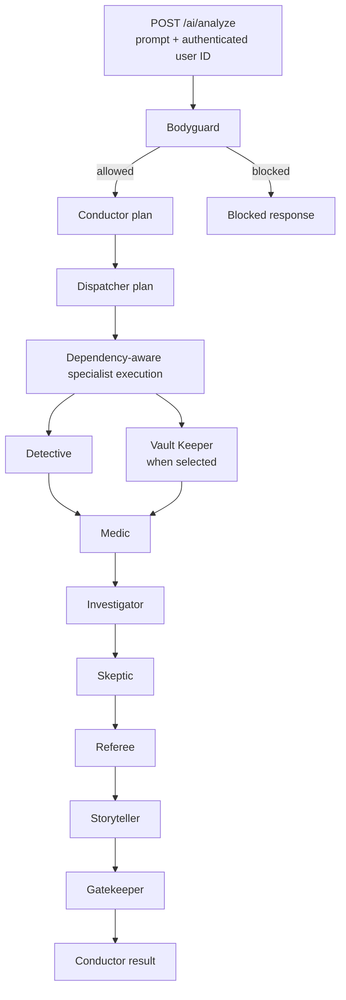
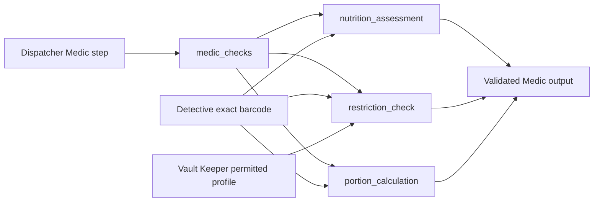

# AI workflow and Medic implementation summary

This document records the AI workflow state after the Bodyguard, Conductor, Dispatcher, Detective, Vault Keeper, and Medic work completed in this session.

## Current workflow design

The workflow is a dependency-driven orchestration flow. `createWorkflowChain()` in `src/ai/workflow.ai.ts` defines execution order. It is the workflow engine, not the Conductor agent.

The Conductor creates the high-level plan and receives the combined result at the end. It does not wrap or execute Bodyguard. Bodyguard is an entry-policy step that runs before planning.



The actual order of specialists is not hard-coded after Dispatcher. Dispatcher selects agents and their dependencies. The execution engine waits for each dependency and runs independent ready agents in parallel.

Important entry points:

| Responsibility                                | File                                                 | Main function or type         |
| --------------------------------------------- | ---------------------------------------------------- | ----------------------------- |
| HTTP request validation and identity boundary | `src/module/main/ai/ai.controller.ts`                | `POST /ai/analyze` handler    |
| Workflow start and timeout boundary           | `src/ai/workflow.ai.ts`                              | `run_consumer_workflow()`     |
| Workflow chain                                | `src/ai/workflow.ai.ts`                              | `create_consumer_workflow()`  |
| Dependency scheduler and aggregate status     | `src/ai/execution.ai.ts`                             | `create_consumer_execution()` |
| Specialist plan contract                      | `src/ai/agent/dispatcher/dispatcher.schema.agent.ts` | `schema_agent_dispatcher`     |
| Product and brand resolution                  | `src/ai/agent/detective/detective.agent.ts`          | `agent_detective()`           |

## Completed security and planning work
  
### 1. Bodyguard is the entry policy

Bodyguard receives the original prompt before any planning or specialist execution. A request that is blocked, sanitized, or requires human review does not continue to Conductor, Dispatcher, or the specialists.

Bodyguard checks security risk. It does not select agents based on product keywords.

The active workflow agents use the configured shared Groq model (`openai/gpt-oss-20b` by default) because the available Google models returned persistent high-demand `503` responses for this server key. Every active agent can use a specific `GROQ_<AGENT>_MODEL` override. Bodyguard uses two SDK retries for retryable temporary provider failures. If retries are exhausted, the workflow remains fail-closed and returns a safe `provider_temporarily_unavailable` limitation without exposing provider details.

### 2. Conductor and workflow have separate responsibilities

The workflow chain manages the stages and dependencies. Conductor creates the execution plan and later assembles the final response shape:

```ts
{
  execution_id,
  status,
  product,
  assessments,
  alternatives,
  explanation,
  sources,
  limitations,
}
```

This final response is different from an individual specialist output such as Detective or Medic.

### 3. Dispatcher selects work from meaning, not keyword lists

Dispatcher reads the prompt, Bodyguard outcome, and Conductor plan. It selects the relevant specialist agents, their dependencies, conditions, required checks, and budgets.

Medic is selected when the request requires a nutrition screen, a compatibility/restriction check, or a requested-portion calculation. It is not selected for every request.

## Detective implementation

The active Detective implementation is:

- `src/ai/agent/detective/detective.agent.ts`
- `src/ai/agent/detective/detective.prompt.agent.ts`
- `src/ai/agent/detective/detective.schema.agent.ts`

The workflow calls `agent_detective()` from `workflow.ai.ts`. Detective resolves the exact product or brand, keeps source evidence, and attaches nutrition only to the matching barcode variant.

The older `src/ai/agent/product-brand-lookup/` implementation duplicated this responsibility but was not referenced by the workflow. It and its dedicated test were removed. The active Detective is now the single product/brand lookup path.

## Vault Keeper implementation

Vault Keeper is implemented as a deterministic workflow adapter and context tool, rather than an LLM agent. Its job is to retrieve only the minimum permitted user context for a selected personalized check.

Files:

- `src/ai/tool/vault-keeper/vault-keeper-context.dto.tool.ts`
- `src/ai/tool/vault-keeper/vault-keeper-context.tool.ts`
- `src/ai/workflow.ai.ts` — `adapter_vault_keeper()`

It returns:

- a minimized permitted profile or `null`;
- personalization and history permission flags;
- missing-information messages.

Private user context stays in backend context. It is not placed in the public workflow input or sent to unrelated agents. Medic can use it only after Vault Keeper releases a valid profile.

## Medic implementation

Medic is connected to the workflow through `adapter_medic()` in `src/ai/workflow.ai.ts`. The adapter performs deterministic, evidence-based checks. It does not ask an LLM to invent nutrition thresholds or decide whether data is sufficient.

`src/ai/agent/medic/medic.agent.ts` and its prompt remain available for Medic agent behavior, but the active workflow adapter uses the verified tools below for assessment decisions.

### Dispatcher-to-Medic contract

A Dispatcher step for Medic must include one or more explicit `medic_checks` values:

```ts
'nutrition_assessment'
'restriction_check'
'portion_calculation'
```

The Dispatcher schema rejects:

- a Medic step without `medic_checks`;
- `medic_checks` attached to another agent.

The execution engine passes those values only to Medic. Medic executes only the selected checks.



### Nutrition assessor

Files:

- `src/ai/tool/medic-nutrition-assessor/medic-nutrition-assessor.dto.tool.ts`
- `src/ai/tool/medic-nutrition-assessor/medic-nutrition-assessor.tool.ts`

The nutrition assessor:

1. Requires Detective's exact barcode.
2. Retrieves nutrition for that same product variant from the local database first, then Open Food Facts when required.
3. Requires current, source-backed measurements with one compatible comparison basis: per 100 g or per 100 mL.
4. Applies a fixed, declared nutrition-label rule profile to total fat, saturated fat, total sugars, and salt.
5. Returns `assessed`, `partial`, or `insufficient_data`, plus findings, evidence references, source metadata, completeness, and limitations.

A `less_favourable` assessment becomes a supported generic `clinical_rule` Medic flag. Its rule ID, measurement, and evidence references are preserved. This is a label-based nutrition screen, not a medical diagnosis or a final consumer recommendation.

The nutrition screen works in generic mode. It does not need access to personal user data.

### Allergen and ingredient restriction checker

Files:

- `src/ai/tool/medic-restriction-checker/medic-restriction-checker.dto.tool.ts`
- `src/ai/tool/medic-restriction-checker/medic-restriction-checker.tool.ts`

This check compares verified product ingredients and allergens against the profile released by Vault Keeper. It distinguishes:

- `allergen_conflict` — a verified exact conflict;
- `ingredient_restriction` — a verified avoided ingredient;
- `possible_allergen_exposure` or `possible_ingredient_exposure` — evidence is incomplete or indicates possible exposure;
- missing evidence — it does not claim the product is clear.

If no permitted profile is available, the restriction check remains incomplete. Generic nutrition analysis can still continue.

### Portion calculator

Files:

- `src/ai/tool/medic-portion-calculator/medic-portion-calculator.dto.tool.ts`
- `src/ai/tool/medic-portion-calculator/medic-portion-calculator.tool.ts`

The portion calculator scales verified nutrition values for one explicit metric amount in the user request, such as `330 mL` or `50 g`.

It refuses to guess when:

- the request has no amount;
- the request has multiple possible amounts;
- the product facts use an incompatible basis;
- required nutrition facts are stale or incomplete.

It never converts grams to millilitres or millilitres to grams without a verified compatible measurement.

### Combined Medic output

The Medic schema preserves all results together:

```ts
{
  status: 'flags_found' | 'no_flags_detected' | 'insufficient_data',
  mode: 'generic' | 'personalized',
  summary,
  checked_scope,
  risk_flags,
  required_restrictions,
  missing_information,
  limitations,
  nutrition_assessment?,
  portion_calculation?,
}
```

The result remains incomplete when a selected Medic check cannot run. The execution aggregate reports the missing Medic check and does not allow it to disappear behind a completed Gatekeeper result.

## Current Medic execution examples

| User request                                  | Dispatcher Medic scopes | Expected behavior                                                                                                |
| --------------------------------------------- | ----------------------- | ---------------------------------------------------------------------------------------------------------------- |
| “Is this drink healthy?”                      | `nutrition_assessment`  | Generic nutrition-label screen using verified facts for the exact barcode.                                       |
| “Can I have this with my allergies?”          | `restriction_check`     | Uses Vault Keeper's permitted profile and verified composition. Missing permission or evidence remains explicit. |
| “How much sugar is in 330 mL?”                | `portion_calculation`   | Scales verified per-100 mL facts for 330 mL.                                                                     |
| “Is 330 mL of this healthy for my allergies?” | all three scopes        | Combines nutrition finding, personalized restriction comparison, and requested-portion nutrient values.          |

## Tests completed

The following tests were added or updated for the implementation:

- `src/module/main/ai/bodyguard.test.ts`
- `src/module/main/ai/vault-keeper-context.test.ts`
- `src/module/main/ai/medic-nutrition-assessor.test.ts`
- `src/module/main/ai/medic-portion-calculator.test.ts`
- `src/module/main/ai/medic-restriction-checker.test.ts`
- `src/module/main/ai/dispatcher.test.ts`
- `src/module/main/ai/execution.test.ts`

They cover:

- bounded Bodyguard retry configuration and temporary-provider failure reporting;
- Dispatcher Medic-scope validation;
- exact barcode use from Detective;
- generic nutrition analysis without private context;
- personalized restriction checking only with released context;
- partial and stale nutrition evidence;
- incompatible nutrition basis handling;
- an exact requested portion;
- combined nutrition, restriction, and portion output;
- incomplete-work reporting when a selected Medic check cannot complete.

Latest verification:

```text
bun.exe test src
223 pass
0 fail
```

## Remaining known issue

`bun.exe run typecheck` now reaches one remaining TypeScript error in `src/module/main/ai/ai.controller.ts`. The route handler can return either a `Response` or the validated JSON body, while its current Elysia route type expects a single compatible response form. This is separate from Medic and does not affect the passing test suite.

## Next implementation work

The next practical work is to implement the remaining Dispatcher-selected specialist adapters one at a time, following the same boundary:

1. accept only declared dependencies;
2. use verified tools and sources;
3. return a validated specialist schema;
4. preserve missing evidence explicitly;
5. add integration tests before connecting the adapter in `workflow.ai.ts`.
