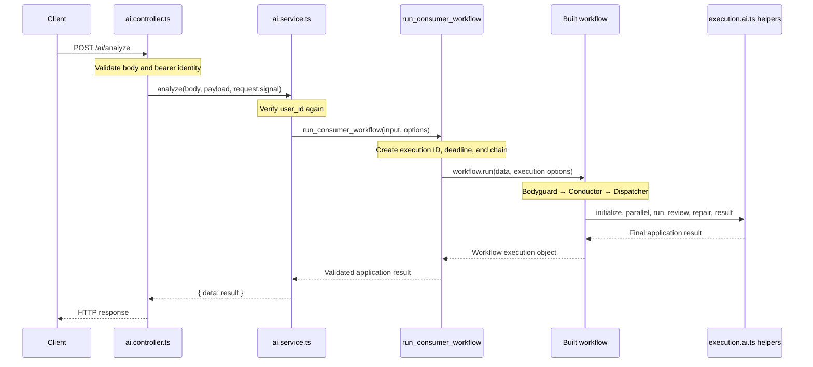

# How to read the AI workflow implementation

This guide follows the current code from an HTTP request to its final response. Read the numbered sections in order the first time, then use the function tables as a reference.

**Current implementation:** Bodyguard, Conductor, and Dispatcher have real agent functions. The remaining stages are connected to replaceable `null` slots. An allowed request normally returns `partial` while those slots are empty. The examples below distinguish current execution from future adapters.

## Contents

1. [Files to read, in order](#1-files-to-read-in-order)
2. [The complete request call path](#2-the-complete-request-call-path)
3. [Read workflow.ai.ts in three passes](#3-read-workflowaits-in-three-passes)
4. [Follow the workflow stages](#4-follow-the-workflow-stages)
5. [Understand the dependency names](#5-understand-the-dependency-names)
6. [Follow the data between steps](#6-follow-the-data-between-steps)
7. [Read execution.ai.ts function by function](#7-read-executionaits-function-by-function)
8. [Trace one request through today's placeholders](#8-trace-one-request-through-todays-placeholders)
9. [Understand final results and failures](#9-understand-final-results-and-failures)
10. [Understand budgets, permissions, and Bait Tester](#10-understand-budgets-permissions-and-bait-tester)
11. [Connect a real specialist later](#11-connect-a-real-specialist-later)
12. [Use the tests and debugging map](#12-use-the-tests-and-debugging-map)

## 1. Files to read, in order

Start with the request path before reading the helper functions in detail.

| Order | File | What to find | What it answers |
| --- | --- | --- | --- |
| 1 | [ai.controller.ts](../src/module/main/ai/ai.controller.ts) | `create_controller_ai`, `POST /ai/analyze` | Where does the request enter? How is identity checked? |
| 2 | [ai.dto.ts](../src/module/main/ai/ai.dto.ts) | `dto_ai.analyze`, `dto_schema_ai_result` | What request and response shapes does HTTP accept? |
| 3 | [ai.service.ts](../src/module/main/ai/ai.service.ts) | `service_ai.analyze` | How does the authenticated request start a workflow? |
| 4 | [workflow.ai.ts](../src/ai/workflow.ai.ts) | `run_consumer_workflow` near the bottom | How are the execution ID, deadline, and workflow run created? |
| 5 | [workflow.ai.ts](../src/ai/workflow.ai.ts) | `create_consumer_workflow` | In what order do the stages run? |
| 6 | [workflow.ai.ts](../src/ai/workflow.ai.ts) | `consumer_dependency`, `default_dependency` near the top | Which actual functions and placeholder slots are connected? |
| 7 | [dispatcher.agent.ts](../src/ai/agent/dispatcher/dispatcher.agent.ts) | `agent_dispatcher`, `$agent_dispatcher` | How does the model produce an execution plan? |
| 8 | [dispatcher.schema.agent.ts](../src/ai/agent/dispatcher/dispatcher.schema.agent.ts) | `schema_agent_dispatcher`, `.superRefine()` | Which plan, dependency, and budget rules are enforced? |
| 9 | [execution.ai.ts](../src/ai/execution.ai.ts) | `create_consumer_execution` and its returned functions | How does the code decide whether and how to call each specialist? |
| 10 | [conductor.schema.agent.ts](../src/ai/agent/conductor/conductor.schema.agent.ts) | Input, plan, and final-result schemas | How are the internal plan and public response different? |

Keep these supporting files nearby:

| File | Responsibility |
| --- | --- |
| [app.ts](../src/app.ts) | Mounts `controller_ai` into the application. The AI controller performs its own JWT checks. |
| [provider.ai.ts](../src/ai/provider.ai.ts) | Creates the shared `ai_google` provider instance. Agent configurations select their models through this instance. |
| [bodyguard.agent.ts](../src/ai/agent/bodyguard/bodyguard.agent.ts) | Defines `$agent_bodyguard` and the `agent_bodyguard()` wrapper. |
| [bodyguard.schema.agent.ts](../src/ai/agent/bodyguard/bodyguard.schema.agent.ts) | Defines `SecurityDecision`. |
| [conductor.agent.ts](../src/ai/agent/conductor/conductor.agent.ts) | Defines the Conductor model and planning wrapper. |
| [dispatcher.prompt.agent.ts](../src/ai/agent/dispatcher/dispatcher.prompt.agent.ts) | Instructions for selecting the smallest sufficient set of agents. |
| [workflow.definition.ts](../src/ai/src/workflow.definition.ts) | Design metadata describing agent roles and intended behavior. Importing it does not execute the workflow. |
| [src/ai/src/index.ts](../src/ai/src/index.ts) | Re-exports `run_consumer_workflow`; it does not start a separate execution. |

### The four main responsibilities

| Component | Responsibility |
| --- | --- |
| Conductor AI agent | Produces an advisory `intent` and proposed `steps`. |
| Dispatcher AI agent | Produces selected agents, exact dependencies, conditions, required checks, and budgets. |
| `workflow.ai.ts` | Builds the fixed stage sequence and connects actual functions to agent names. |
| `execution.ai.ts` | Applies selection, prerequisite, permission, budget, and result-handling rules within those stages. |

`createWorkflowChain()` builds a workflow object. The Conductor AI agent is one participant inside that workflow. Bodyguard is its own preceding step. The step named `conductor-result` is ordinary TypeScript that returns the aggregate; it does not make another Conductor model call.

## 2. The complete request call path

Example request, using a bearer token whose authenticated user ID is also `2`:

```http
POST /ai/analyze
Authorization: Bearer <token>
Content-Type: application/json

{
  "prompt": "give me info about coca cola",
  "user_id": 2
}
```



The relevant calls are:

```text
src/app.ts
  .use(controller_ai)

ai.controller.ts
  create_controller_ai()
    POST /ai/analyze handler
      service.analyze(body, payload, request.signal)

ai.service.ts
  service_ai.analyze(body, payload, signal)
    run_consumer_workflow(
      { ...body, user_id: payload.user_id },
      { signal }
    )

workflow.ai.ts
  run_consumer_workflow(input, options)
    create_consumer_workflow(dependency, signal, deadline_ms)
      create_consumer_execution(dependency, signal, deadline_ms)
      createWorkflowChain(...).andThen(...).andAll(...)
    workflow.run(data, { executionId, userId })
    validate and return execution.result
```

The user ID comes from authenticated server context after the identity checks. Sending another user's ID in the JSON body does not authorize their workflow.

## 3. Read workflow.ai.ts in three passes

### Pass A: start at `run_consumer_workflow()`

This is the application entry point called by the service.

1. Validate and normalize `input` using `schema_agent_conductor_input`.
2. Generate `execution_id`.
3. Choose the overall timeout: currently `60_000` ms by default.
4. Calculate the deadline and combine timeout with any caller cancellation signal.
5. Use `options.dependency` when supplied, otherwise `default_dependency`.
6. Build the request's workflow with `create_consumer_workflow()`.
7. Execute it through `workflow.run()`.
8. Validate a successful workflow's application result, or produce a minimal error result.

Tests inject `options.dependency` to replace model calls. Normal service requests use the default adapters.

### Pass B: read `create_consumer_workflow()`

This function constructs the chain. Construction registers callbacks; `workflow.run()` is what executes them.

The line:

```ts
const execution = create_consumer_execution(dependency, signal, deadline_ms)
```

creates a group of ordinary helper functions that share this request's deadline and counters:

```ts
{
  initialize,
  parallel,
  run,
  review_candidates,
  repair_response,
  result,
}
```

Inside this function, `execution.run('Skeptic', data)` means “run one specialist through the helper.” Later, inside `run_consumer_workflow()`, the variable `execution` holds the result returned by `workflow.run()`. These two variables have different scopes and different meanings.

### Pass C: read `default_dependency`

This object connects the workflow to executable functions:

```text
default_dependency.bodyguard  → agent_bodyguard()
default_dependency.conductor  → agent_conductor()
default_dependency.dispatcher → agent_dispatcher()

default_dependency.specialists.Detective       → null today
default_dependency.specialists.Investigator    → null today
default_dependency.specialists[other names]    → null today

default_dependency.candidate_review → null today
default_dependency.bait_tester      → null today
```

The startup adapters unwrap the agents' `{ success, data }` results. They return the successful data or throw an error with its original cause.

### The actual Bodyguard model call

```text
workflow's bodyguard step
  → dependency.bodyguard(data.prompt, signal)
  → default_dependency.bodyguard(prompt, signal)
  → agent_bodyguard(prompt, signal)
  → $agent_bodyguard.generateText(prompt, options)
  → structured model output
  → SecurityDecision.parse(...)
  → { success: true, data: decision }
  → adapter returns decision
  → workflow returns { ...data, bodyguard: decision }
```

`$agent_bodyguard` is the configured VoltAgent object. `agent_bodyguard()` is the wrapper that invokes it. The same naming pattern is used by Conductor and Dispatcher.

All three configured agents import `ai_google` from [provider.ai.ts](../src/ai/provider.ai.ts), select a model through `ai_google(...)`, and currently disable agent memory.

## 4. Follow the workflow stages

Find these IDs in `create_consumer_workflow()` and read from top to bottom.

| Order | Stage ID | Main call or action | Result added or produced |
| --- | --- | --- | --- |
| 1 | `conductor-initialize` | Read `state.executionId` | `execution_id` |
| 2 | `bodyguard` | `dependency.bodyguard(...)` and `SecurityDecision.parse(...)` | `bodyguard` |
| 3 | `conductor-plan` | Call Conductor only when `safe === true` and `action === 'allow'` | `plan`, or `null` |
| 4 | `dispatcher-plan` | Call Dispatcher with prompt, decision, advisory plan, and remaining budget | `dispatcher_plan`, or `null` |
| 5 | `specialists-initialize` | `execution.initialize(data)` | Empty `agent_results`, `candidate_review: null`, specialist deadline |
| 6 | `product-and-personal-context` | `.andAll()` with Detective and Vault Keeper branches | Array of branch updates |
| 7 | `merge-product-and-context` | `merge_consumer_parallel(data)` | One combined workflow data object |
| 8 | `specialist-checks` | `.andAll()` with Medic, Investigator, Eco Scout, and Historian branches | Array of branch updates |
| 9 | `merge-specialist-checks` | `merge_consumer_parallel(data)` | One combined workflow data object |
| 10 | `skeptic` | `execution.run('Skeptic', data)` | Evidence-review record |
| 11 | `referee` | `execution.run('Referee', data)` | Hard-constraint record |
| 12 | `coach` | `execution.run('Coach', data)` | Goal-fit record if selected and permitted |
| 13 | `bargain-hunter` | `execution.run('Bargain Hunter', data)` | Alternative-candidate record if selected |
| 14 | `candidate-review` | `execution.review_candidates(data)` | Separate candidate-review record when required |
| 15 | `storyteller` | `execution.run('Storyteller', data)` | Draft explanation record |
| 16 | `gatekeeper` | `execution.run('Gatekeeper', data)` | Final-validation record |
| 17 | `response-repair` | `execution.repair_response(data)` | Bounded Storyteller/Gatekeeper repair, if requested |
| 18 | `conductor-result` | `execution.result(data)` | Eight-field public application result |

The chain contains all these stages for every request. The specialist helper decides which adapters are eligible inside those stages. A registered stage can finish without calling any model.

The two parallel groups are fixed barriers: the workflow waits for every branch in one group before continuing. This is a staged implementation, not a general scheduler that launches arbitrary agents whenever one dependency finishes.

## 5. Understand the dependency names

There are several similarly named concepts:

| Name | What it contains | Does it call an agent? |
| --- | --- | --- |
| `consumer_dependency` | A TypeScript type describing available function signatures | No. A type does not execute code. |
| `default_dependency` | Actual startup functions and specialist slots | Its functions call agents when invoked. |
| `dependency` parameter | The implementation object selected for this execution | Code invokes functions from this object. |
| Dispatcher `depends_on` | Agent names that must provide prerequisite results | No. It describes an ordering rule. |
| Adapter `input.dependencies` | The actual result envelopes of those prerequisite agents | No. The adapter reads them as input. |

Example Dispatcher entry:

```json
{
  "agent": "Medic",
  "depends_on": ["Detective", "Vault Keeper"],
  "run_when": "always"
}
```

When Medic is connected, the executor checks both predecessor records for `status: 'completed'`. Then Medic can read:

```ts
input.dependencies.Detective?.output
input.dependencies['Vault Keeper']?.output
```

`run_when: 'always'` still requires selection, a connected adapter, valid prerequisites, and available runtime budget. It is not permission to bypass those checks.

### Dependencies enforced by the current Dispatcher schema

| Agent | Required predecessor names |
| --- | --- |
| Detective | None |
| Vault Keeper | None |
| Medic | Detective; also Vault Keeper when selected |
| Investigator | Detective |
| Eco Scout | Detective |
| Historian | Vault Keeper |
| Skeptic | Detective and every selected Medic, Investigator, Eco Scout, Historian |
| Referee | Skeptic |
| Coach | Vault Keeper and Referee |
| Bargain Hunter | Detective and Referee; also Coach when selected |
| Storyteller | Skeptic and Referee; also selected Coach and Bargain Hunter |
| Gatekeeper | Storyteller |

Coach additionally requires `personalization_permitted`. Historian requires `history_permitted`.

Dispatcher chooses from these rules in one planning call. It does not invoke the selected specialists itself or modify the chain's JavaScript structure.

## 6. Follow the data between steps

There are three different output shapes to keep separate:

| Shape | Example | Purpose |
| --- | --- | --- |
| Agent wrapper result | `{ success: true, data: parsedOutput }` | Reports the result of calling a model wrapper. |
| Specialist adapter result | `{ status: 'completed', output, limitations: [] }` | Gives the workflow a domain outcome it can use for gating. |
| API result | `{ execution_id, status, product, assessments, alternatives, explanation, sources, limitations }` | The final public analysis response. |

Dispatcher's structured `data` is a **plan** with `selected_agents`, `required_checks`, `budgets`, `untrusted_content_policy`, and `candidate_validation`. It is not any specialist's findings.

### How the internal workflow object grows

The following is a shape illustration; names on the right refer to earlier computed values:

```ts
// Input
{ prompt, user_id }

// After conductor-initialize
{ prompt, user_id, execution_id }

// After bodyguard
{ prompt, user_id, execution_id, bodyguard }

// After conductor-plan and dispatcher-plan
{ prompt, user_id, execution_id, bodyguard, plan, dispatcher_plan }

// After specialists-initialize
{
  prompt, user_id, execution_id, bodyguard, plan, dispatcher_plan,
  agent_results: {},
  candidate_review: null,
}

// Later, with connected agents or recorded placeholders
{
  // ...earlier fields...
  agent_results: {
    Detective: { status, output, limitations },
    'Vault Keeper': { status, output, limitations, permissions },
  },
  candidate_review: null,
}
```

Read this shape in `consumer_execution_data` near the top of [execution.ai.ts](../src/ai/execution.ai.ts).

### Why `return { ...data, bodyguard }` matters

An `.andThen()` callback returns the next step's input. Spreading `...data` preserves the previous fields; adding `bodyguard` makes the new decision available downstream. Returning only `{ bodyguard }` would discard the earlier request and execution fields from that returned object.

### What happens at `.andAll()`

In the installed workflow implementation, `.andAll()` returns an array of branch results. Each branch in this scaffold returns a `consumer_parallel_result`:

```ts
// Illustrative array produced by the first parallel group
[
  { data: original_data, updates: { Detective: detective_result } },
  { data: original_data, updates: { 'Vault Keeper': vault_result } },
]
```

`merge_consumer_parallel()` keeps the original data and merges only the branch additions:

```ts
{
  ...original_data,
  agent_results: {
    ...original_data.agent_results,
    Detective: detective_result,
    'Vault Keeper': vault_result,
  },
}
```

An unselected branch produces `updates: {}`. The second parallel group merges the same way, preserving the Detective and Vault Keeper records already collected.

## 7. Read execution.ai.ts function by function

### A. Read the types first

| Type | Meaning |
| --- | --- |
| `consumer_specialist_name` | The names allowed in Dispatcher's `selected_agents`. |
| `consumer_step_result` | The common status/output/limitations envelope, with optional permission flags. |
| `consumer_specialist_input` | The request context, prerequisite results, budget snapshot, and helper functions passed to an adapter. |
| `consumer_specialist` | A function accepting that input plus an abort signal. |
| `consumer_execution_dependency` | Optional specialist, candidate-review, and Bait Tester connections. |
| `consumer_execution_data` | Internal state passed along the chain. |
| `consumer_parallel_result` | Original data plus one branch's additions. |

`schema_step_result` validates the common envelope. Its `output` field is `unknown`: each adapter must validate its own domain output before returning it. The helper cannot determine whether an arbitrary product or medical output is correct merely from the envelope.

### B. Read `create_consumer_execution()`

This factory creates functions that close over the same request-local variables:

```text
signal                Combined cancellation / deadline signal
execution_deadline    Absolute deadline measured with performance.now()
tool_calls            Number of tool calls charged so far
budget_exhausted      Whether an attempted call exceeded the shared tool budget
budgets               Dispatcher limits copied during initialization
```

`run_consumer_workflow()` constructs a new chain and helper object per request, so concurrent requests use separate counters.

### C. Follow a specialist from the chain into its adapter

For a sequential stage:

```text
.andThen({ id: 'skeptic', execute: ... })
  → execution.run('Skeptic', data)
  → execute('Skeptic', data)              internal helper
  → selection / slot / permission / prerequisite checks
  → input_for(data, step.depends_on)
  → invoke(handler, input)
  → handler(input, signal)               your adapter, when connected
  → validate its workflow envelope
  → return data with agent_results.Skeptic
```

For a parallel branch:

```text
andThen({ id: 'investigator', execute: ... })
  → execution.parallel('Investigator', data)
  → execute('Investigator', data)        same internal checks
  → invoke(handler, input)
  → return { data, updates: { Investigator: result } }
  → .andAll() collects all branches
  → merge_consumer_parallel(branches)
```

The word `execute` occurs in two places: the callback property on a VoltAgent step, and the private helper inside `create_consumer_execution()`. The latter contains this project's specialist routing logic.

### D. Read the checks inside `execute()` in their actual order

1. Check cancellation and deadline.
2. Find the agent in `data.dispatcher_plan.selected_agents`.
3. If it is absent, return `undefined`: no adapter call and no agent result entry.
4. Look up `dependency.specialists[agent]`.
5. If the slot is empty, return `placeholder(agent)` with `status: 'not_implemented'`.
6. Check any required personalization or history permission.
7. Check that every `depends_on` record is `completed`.
8. For Storyteller, require completed candidate review if alternatives were selected.
9. Build input with `input_for()`; add `user_id` only for Vault Keeper, and repair feedback when present.
10. Call `invoke()` and return its result. Remove permission flags from results produced by agents other than Vault Keeper.

| Situation | Internal result |
| --- | --- |
| Agent not selected | No record; no adapter call |
| Selected agent has a `null` slot | `not_implemented` |
| Connected agent lacks permission or a completed prerequisite | `skipped` with a reason |
| Connected agent returns a valid envelope | Its declared domain status |
| Adapter throws repeatedly or returns an invalid envelope | Usually `needs_review` after the retry allowance is exhausted |
| Cancellation or deadline expires | The error propagates to the workflow failure path |

The missing-slot check happens before permission and prerequisite checks. This is why all selected empty slots are listed as unimplemented, even when earlier agents are also missing.

### E. Use this function reference

| Function | Called by | What to notice |
| --- | --- | --- |
| `initialize(data)` | `specialists-initialize` | Starts the specialist budget and creates empty result containers. |
| `parallel(agent, data)` | Branches inside the two `.andAll()` groups | Calls the internal `execute()` helper and returns branch updates. |
| `run(agent, data, feedback?)` | Sequential stages and repair attempts | Calls `execute()` and returns one updated workflow object. |
| `execute(agent, data, feedback?)` | `run()` and `parallel()` | Implements selection, placeholders, permission, and prerequisite checks. |
| `input_for(data, required)` | `execute()` and candidate review | Passes prerequisite envelopes instead of the entire internal workflow object. |
| `invoke(handler, input)` | `execute()` and candidate review | Calls the adapter, validates its envelope, and handles bounded retries. |
| `check_deadline()` | Runtime helper functions | Checks the signal and the absolute deadline. |
| `use_tool(call)` | A future adapter or its tool execution boundary | Charges one shared tool call before starting it, then checks the deadline again. |
| `inspect_content(text)` | A future adapter before consuming external text | Calls the configured Bait Tester with text and signal only. |
| `review_candidates(data)` | `candidate-review` | Calls the separate review adapter only when alternatives require it and Bargain Hunter completed. |
| `repair_response(data)` | `response-repair` | Repeats Storyteller and Gatekeeper when the latter requests repair, within the configured cap. |
| `result(data)` | `conductor-result` | Produces the public response after approval, or a minimal unresolved/restrictive response. |
| `merge_consumer_parallel(branches)` | Both merge stages | Combines parallel updates without losing previous results. This function is exported separately from the factory. |
| `skipped(reason)` / `placeholder(name)` | Routing helpers | Construct truthful internal records without making model calls. |

Only `initialize`, `parallel`, `run`, `review_candidates`, `repair_response`, and `result` are returned on the `execution` helper object. `use_tool` and `inspect_content` are passed to connected adapters through their input.

## 8. Trace one request through today's placeholders

Use this prompt as a concrete example:

> give me info about coca cola

Assume Bodyguard allows it, Conductor planning succeeds, and Dispatcher returns the minimal plan described in its prompt:

```text
Detective → Skeptic → Referee → Storyteller → Gatekeeper
```

That is an illustrative valid plan; the actual model response still needs to pass the schema.

| Point in the chain | What happens with today's default slots |
| --- | --- |
| Bodyguard | Its wrapper makes a real model call and returns the decision. |
| Conductor | Its wrapper makes a real model call and returns an advisory plan. |
| Dispatcher | Its wrapper makes a real model call and returns a validated execution plan. |
| First parallel group | Detective records `not_implemented`; unselected Vault Keeper returns no update. |
| Second parallel group | All four specialists are unselected, so their branches return empty updates. |
| Skeptic and Referee | Each selected empty slot records `not_implemented`. |
| Coach and Bargain Hunter | Both are unselected; their adapters are not called. |
| Candidate review | No review is requested for this plan. |
| Storyteller and Gatekeeper | Each records `not_implemented`. |
| Response repair | No repair is requested by Gatekeeper. |
| Final result | Returns `partial`, empty analysis fields, and limitations naming the missing work. |

The internal result map contains the five selected names. It is not exposed directly in the API response.

If the prompt also asks about boycott or ownership, Dispatcher should select Investigator, add the `ethics` check, and make Skeptic wait for Investigator. The existing `investigator` branch is already in the second parallel group; connecting its adapter does not require adding another stage.

## 9. Understand final results and failures

### Two different meanings of completion

```ts
const execution = await workflow.run(...)
```

`execution.status === 'completed'` means the workflow engine finished the chain normally. `execution.result.status` is the application's analysis status and may still be `partial`, `blocked`, `needs_input`, or `needs_review`.

For example, recording all placeholders and returning a `partial` response is a normally completed workflow run.

### The successful approval path

`execution.result(data)` accepts a Gatekeeper output only when:

1. Bodyguard allowed the request.
2. Every selected agent record is `completed`.
3. Candidate review is completed when required.
4. Gatekeeper itself is `completed`.
5. Its `output` parses as `schema_agent_conductor_result`.

The helper preserves the actual execution ID. It does not invent or concatenate product findings from arbitrary intermediate outputs. **The future Gatekeeper adapter is responsible for returning the complete approved response**, based on the draft and reviewed evidence supplied through the preceding agents.

The service wraps that result once:

```ts
{
  data: {
    execution_id,
    status,
    product,
    assessments,
    alternatives,
    explanation,
    sources,
    limitations,
  },
}
```

`schema_agent_conductor_plan` validates Conductor's advisory `{ intent, steps }`. `schema_agent_conductor` and its alias `schema_agent_conductor_result` validate these eight final fields. The name “Conductor” appears in both schemas, but their purposes differ.

### The unresolved-result path

When final approval is unavailable, the current helper returns empty analysis fields and chooses a status in this order:

| Condition | Application status |
| --- | --- |
| Bodyguard did not allow the request | `needs_review` for `human_review`; otherwise `blocked` |
| A recorded agent has `blocked` | `blocked` |
| A recorded agent has `error` | `error` |
| A recorded agent has `needs_input` | `needs_input` |
| All recorded agents are placeholders or skipped | `partial` |
| Other unresolved checks remain | `needs_review` |

A connected prerequisite must be `completed` before its dependent adapter runs. Under this conservative scaffold, a blocked Referee prevents Coach and subsequent dependent adapters from running; the code returns a minimal restrictive response.

### Exceptions that escape the chain

`run_consumer_workflow()` uses `describe_workflow_failure()` when execution fails. That function classifies cancellation, timeout, and recognized provider failures. It logs an execution ID, step, failure code, and provider status, then returns a minimal application error with a sanitized limitation.

HTTP authentication and body-validation failures happen at the controller boundary before the workflow. An application result with `status: 'error'` is a different layer from an HTTP authentication failure.

## 10. Understand budgets, permissions, and Bait Tester

### Time and tool budgets

```text
Overall deadline created in run_consumer_workflow()
  → Bodyguard and Conductor consume part of that time
  → Dispatcher receives only the remaining allowance
  → agent_dispatcher() accounts for its own planning time
  → execution.initialize() establishes the specialist deadline
  → every specialist, retry, candidate review, and repair shares it
```

`check_deadline()` compares `performance.now()` against an absolute deadline. The combined signal is also supplied to adapters so their model calls and I/O can stop promptly.

`input.budgets` is a snapshot, not an independent budget for that agent. `input.use_tool()` charges the shared counter before invoking the supplied function. A future agent with internally registered tools must integrate this helper at each actual tool call; it is not automatically attached to every VoltAgent tool by the scaffold.

`invoke()` retries thrown failures and invalid envelopes up to the Dispatcher allowance. A valid returned `needs_review` status is an outcome, not an exception to retry. Deadline and cancellation checks stop further attempts.

### Permissions and user context

The executor supplies `user_id` only to the Vault Keeper specialist adapter. Vault Keeper must perform actual consent verification through the appropriate service before returning permitted context and permission flags:

```ts
permissions: {
  personalization: true,
  history: false,
}
```

Those example flags would allow Coach's permission condition and deny Historian's. Other prerequisites must still be completed. The example values are not default permissions.

**Current code detail:** `agent_conductor()` receives the prompt and signal; its configuration does not register an `extractIntent` tool or a database retrieval tool. Its prompt and schema contain wording about database-derived intent, but that wording does not implement retrieval. Treat its current plan as advisory. Actual saved goals and restrictions still require the future Vault Keeper integration.

### On-demand Bait Tester

```text
Connected adapter encounters external free text
  → input.inspect_content(text)
  → dependency.bait_tester(text, signal)
  → usable text, or an exception preventing consumption
```

Bait Tester is not a scheduled member of Dispatcher's `selected_agents`. Its callback receives no user ID, dependency map, or tool helper from this executor. A real Bait Tester agent must also be configured without privileged tools. Its output still needs later evidence review.

### Candidate review and response repair

Candidate review has a separate slot after Bargain Hunter. The workflow requires a completed review before Storyteller when alternatives are selected. The actual per-candidate identity and specialist checks, candidate count limit, and review-pass limit must be implemented inside the future review adapter; the current scaffold supplies context and shared runtime helpers.

For final response repair:

```text
Gatekeeper returns repair_required
  → check max_response_repairs
  → rerun Storyteller with input.feedback
  → rerun Gatekeeper
  → approved result, unresolved result, or repair-budget error
```

### Design metadata versus executable behavior

[workflow.definition.ts](../src/ai/src/workflow.definition.ts) also documents intended future behavior. Read `workflow.ai.ts` and `execution.ai.ts` to see what is actually enforced today. For example, the design mentions sending rejected requests through Gatekeeper; the current code returns a minimal schema-validated rejection without calling a specialist Gatekeeper adapter after Bodyguard rejection.

## 11. Connect a real specialist later

Use [workflow-placeholders.md](workflow-placeholders.md) for the adapter example and complete integration contract.

The development order is:

1. Implement the agent's prompt, output schema, and `agent_<name>()` wrapper.
2. Import the wrapper and schema in `workflow.ai.ts`.
3. Replace that agent's `null` entry in `default_dependency.specialists` with an adapter.
4. Build the model input from the relevant `input.dependencies` outputs.
5. Pass the provided signal and integrate the shared tool/content helpers where applicable.
6. Validate the agent-specific output, then map its domain outcome to `{ status, output, limitations }`.
7. Keep missing evidence, ambiguity, and restrictions visible through the appropriate status.

The resulting call path will be:

```text
Workflow stage
  → execution.run() or execution.parallel()
  → execute() checks the plan and prerequisites
  → invoke()
  → default_dependency.specialists['Agent Name'](input, signal)
  → agent_<name>(prepared_input, signal)       future wrapper
  → $agent_<name>.generateText(...)           future configured agent
  → agent-specific schema validation
  → workflow result envelope
```

For an agent already listed in the placeholder map, the stage exists. For a completely new role, update the Dispatcher allowed names, checks, dependency rules, prompt, workflow position, adapter types as needed, and tests as well.

## 12. Use the tests and debugging map

### Read these tests after the implementation

| File | What its examples demonstrate |
| --- | --- |
| [ai.test.ts](../src/module/main/ai/ai.test.ts) | HTTP validation, bearer identity, service boundary, and the public response shape. |
| [consumer.test.ts](../src/module/main/ai/consumer.test.ts) | Startup ordering, Bodyguard rejection, Dispatcher connection, remaining time, cancellation, and sanitized provider errors. |
| [dispatcher.test.ts](../src/module/main/ai/dispatcher.test.ts) | Valid and invalid plans, mandatory roles, dependencies, permissions, alternatives, and planner budgets. |
| [execution.test.ts](../src/module/main/ai/execution.test.ts) | Placeholder behavior, both parallel groups, result merging, gating, consent, tool budgets, Bait Tester, candidate review, and bounded repair. |

The connected specialists in `execution.test.ts` are mocks used to exercise the workflow. They do not mean production implementations exist in the specialist slots.

### Where to place a breakpoint

| Question | File and function |
| --- | --- |
| Did the request reach the API? | `ai.controller.ts` → `/analyze` handler |
| Which user ID and signal reach the workflow? | `ai.service.ts` → `analyze()` |
| Which adapters are being used? | `workflow.ai.ts` → `run_consumer_workflow()` and `default_dependency` |
| What did Dispatcher select? | `workflow.ai.ts` → return from `dispatcher-plan` |
| Why did an agent not run? | `execution.ai.ts` → private `execute()` helper |
| What does a specialist receive? | `execution.ai.ts` → `input_for()` and the adapter called by `invoke()` |
| Were parallel outputs preserved? | `execution.ai.ts` → `merge_consumer_parallel()` |
| Why is a check unresolved? | `data.agent_results['Agent Name']` → `status` and `limitations` |
| Why are alternatives withheld? | `review_candidates()` and Storyteller's check inside `execute()` |
| Why is the response still partial or restricted? | `execution.ai.ts` → `result()` |
| Why did the whole workflow fail? | `workflow.ai.ts` → `describe_workflow_failure()` |

For future code changes, the relevant checks are:

```bash
bun test src/module/main/ai
bun run typecheck
```

Use `bun.exe` instead of `bun` if running through your Windows Bun installation from WSL. This document only explains the implementation; creating it does not run the application or call an AI provider.
