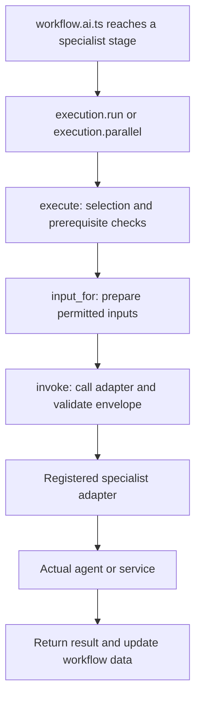
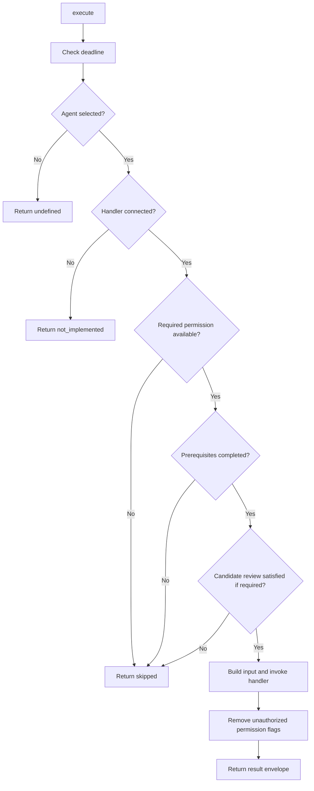

# execution.ai.ts: every type and function explained

This reference explains the implementation in [src/ai/execution.ai.ts](../src/ai/execution.ai.ts), as read on September 18, 2026. It covers all seven exported types, the runtime result schema, the imported types they use, and all sixteen named functions.

Read sections 1–4 to understand the data, then section 5 alongside the source. Section 6 traces actual calls. Examples with product findings or connected specialist handlers are illustrations; the default specialist slots in `workflow.ai.ts` are currently `null`.

## Contents

1. [What this file does](#1-what-this-file-does)
2. [TypeScript notation used in this file](#2-typescript-notation-used-in-this-file)
3. [Imported types and schemas](#3-imported-types-and-schemas)
4. [Every local type and the result schema](#4-every-local-type-and-the-result-schema)
5. [Every named function](#5-every-named-function)
6. [Follow complete execution examples](#6-follow-complete-execution-examples)
7. [Behavior to remember when connecting agents](#7-behavior-to-remember-when-connecting-agents)
8. [Source and test map](#8-source-and-test-map)

## 1. What this file does

`execution.ai.ts` provides the rules for running specialists inside the workflow. It answers:

- Was this agent selected by Dispatcher?
- Is its implementation connected?
- Are its permissions and prerequisite results available?
- What data should its handler receive?
- Can it still spend time or call tools?
- How should its result affect the final response?

The responsibilities are divided as follows:

| Component | Responsibility |
| --- | --- |
| `workflow.ai.ts` | Defines stage order, parallel groups, startup agent calls, and the default implementations. |
| Dispatcher agent | Returns a validated plan containing selected agents, prerequisites, conditions, and budgets. |
| `execution.ai.ts` | Applies that plan when a predefined workflow stage is reached. |
| Specialist adapter | Calls a real agent, validates its domain output, and translates it into the common result format. |



The file contains no direct model initialization or `.generateText()` call. The actual specialist call happens through a function supplied in `dependency`.

There are two categories of state:

| State | Location | Examples |
| --- | --- | --- |
| Workflow data | Passed between steps as `data` | Request, Dispatcher plan, specialist results, candidate review. |
| Execution control | Private variables inside `create_consumer_execution()` | Current signal, absolute deadline, tool counter, budget exhaustion flag. |

The helper factory is called once when building a workflow for a request. Calling the factory creates its functions and private state; specialist execution starts later when the workflow invokes those functions.

## 2. TypeScript notation used in this file

These constructs appear throughout the types and functions:

| Syntax | Meaning here |
| --- | --- |
| `import type { X }` | Imports a compile-time type. It does not create a runtime value or call a function. |
| `export type X = ...` | Allows other modules to use a type definition. |
| `typeof schema_step_result` | In a type expression, refers to the type of that schema object. |
| `z.infer<typeof schema>` | Derives a TypeScript output type from a Zod schema. |
| `T['field']` | Reads a property's type from another type. |
| `ArrayType[number]` | Reads the type of one array element, without choosing a runtime index. |
| `Record<Key, Value>` | Describes an object whose keys come from `Key` and whose values have type `Value`. |
| `Partial<T>` | Makes each property of `T` optional. Useful because only some agents have results. |
| `Omit<T, 'a' \| 'b'>` | Describes `T` without the named properties. Used for data before initialization. |
| `A & B` | An intersection: the value must satisfy both object shapes. |
| `A \| null` | The value can be an `A` or explicitly `null`. |
| `field?: T` | The property may be absent. Reading it can produce `undefined`. |
| `Promise<T>` | An asynchronous operation eventually resolves to a `T`, or rejects. |
| `<T>` on `use_tool` | A generic type preserving whatever result the supplied tool returns. |
| `unknown` | A value whose domain shape has not been established. Validate or narrow it before using its properties. |
| `AbortSignal` | A runtime cancellation signal passed into asynchronous work. |

Related runtime syntax:

| Syntax | Meaning here |
| --- | --- |
| `data.dispatcher_plan?.selected_agents` | Optional chaining: reading through a missing plan gives `undefined`. |
| `value ?? fallback` | Uses the fallback only when the value is `null` or `undefined`. A numeric zero stays zero. |
| `{ ...data, agent_results: next }` | Creates a shallow object copy and replaces `agent_results`. |
| `{ [agent]: result }` | Uses the current agent name as a computed property key. |
| `await handler(input, signal)` | Calls the supplied function and waits for its result. |
| `schema.parse(value)` | Validates at runtime; returns a parsed value or throws. |
| `throw` | Stops the current operation and sends the error to the nearest matching error handler. |

**Types and validation have different jobs.** `consumer_specialist` helps TypeScript check your code. `schema_step_result.parse(...)` checks the value returned at runtime, including values coming from an AI call.

## 3. Imported types and schemas

### 3.1 `type_schema_agent_bodyguard`

Defined by `SecurityDecision` in [bodyguard.schema.agent.ts](../src/ai/agent/bodyguard/bodyguard.schema.agent.ts).

| Field | Shape | Use in this executor |
| --- | --- | --- |
| `safe` | `boolean` | Combined with `action === 'allow'` when producing the final result. |
| `riskLevel` | `none`, `low`, `medium`, `high`, `critical` | Preserved in workflow data; not used to schedule specialists here. |
| `risks` | Array of risk names from the Bodyguard schema | Preserved for the decision record. |
| `action` | `allow`, `sanitize`, `block`, `human_review` | Determines entry approval and the restrictive fallback status. |
| `reason` | `string` | Bodyguard's explanation; not copied directly into the public fallback. |
| `confidence` | Number from 0 through 1 | Part of the validated decision. |

The allowed risk names are `prompt_injection`, `jailbreak`, `credential_exfiltration`, `pii_exposure`, `secret_extraction`, `tool_abuse`, `data_exfiltration`, `command_injection`, `sql_injection`, `ssrf`, `malicious_url`, `malicious_code`, `privilege_escalation`, `policy_bypass`, `resource_abuse`, and `unknown`.

The current workflow approves only `safe: true` together with `action: 'allow'`. It does not implement a sanitize-and-resubmit path.

### 3.2 `type_schema_agent_conductor_input`

Defined in [conductor.schema.agent.ts](../src/ai/agent/conductor/conductor.schema.agent.ts):

```ts
{
  prompt: string
  user_id: number
}
```

Its runtime schema trims the prompt and requires 1–4000 characters. `user_id` must be a positive integer no larger than `Number.MAX_SAFE_INTEGER`.

`consumer_execution_data` extends this input, so every normal workflow data object retains the original prompt and user ID. Authentication is performed before reaching this file.

### 3.3 `type_schema_agent_conductor_plan`

Also defined in the Conductor schema file:

```ts
{
  intent: string
  steps: Array<{
    agent: ConsumerAgentName
    purpose: string
  }>
}
```

`intent` and each `purpose` contain 1–1000 characters; the plan has at most 16 steps. `ConsumerAgentName` refers here to the broader workflow catalog exported from `workflow.definition.ts`, which also includes startup agents and Bait Tester.

The executor carries this advisory plan as `data.plan`. It routes specialists from `data.dispatcher_plan`, rather than reading Conductor's `steps`.

The schema's description of database-derived intent is descriptive text. Nothing in this type or in `execution.ai.ts` retrieves database values. A connected service or agent implementation must perform that retrieval.

### 3.4 `type_schema_agent_dispatcher`

Defined and runtime-validated in [dispatcher.schema.agent.ts](../src/ai/agent/dispatcher/dispatcher.schema.agent.ts).

| Field | Meaning |
| --- | --- |
| `selected_agents` | Array of `{ agent, depends_on, run_when }` entries. |
| `required_checks` | Named checks matching the selected roles. |
| `budgets` | Time, tool, retry, candidate, review, and repair limits. |
| `untrusted_content_policy` | Literal value `bait_tester_before_consumption`. |
| `candidate_validation` | `not_requested` or `repeat_required_checks`. |

For one selected entry:

```ts
{
  agent: 'Medic',
  depends_on: ['Detective', 'Vault Keeper'],
  run_when: 'always',
}
```

This means Medic needs completed Detective and Vault Keeper results when both are in this valid plan. `always` still requires a connected handler and completed prerequisites.

`run_when` has three possibilities: `always`, `personalization_permitted`, and `history_permitted`.

The allowed check names are `identity`, `personal_context`, `clinical_risk`, `ethics`, `environment`, `history`, `evidence`, `hard_constraints`, `goal_fit`, `alternatives`, and `final_response`.

The Dispatcher schema requires 5–12 unique selected agents, including Detective, Skeptic, Referee, Storyteller, and Gatekeeper. It also checks the exact prerequisite sets and the correspondence between selected roles and required checks. Coach uses `personalization_permitted`, Historian uses `history_permitted`, and other roles use `always`.

The budget fields are:

| Field | Current schema range | Where enforcement happens |
| --- | --- | --- |
| `timeout_ms` | Integer, 1–60,000 | `initialize()`, the signal, and `check_deadline()`. |
| `max_tool_calls` | Integer, 0–20 | `use_tool()` and the shared counter. |
| `max_retries` | Integer, 0–1 | `invoke()`, per invocation. |
| `max_alternative_candidates` | Integer, 0–3 | Must be enforced by the future candidate-review adapter. |
| `max_candidate_review_passes` | Integer, 0–1 | Must be enforced by the future candidate-review adapter. |
| `max_response_repairs` | Integer, 0–1 | `repair_response()`. |

These are upper bounds, not a promise that every request receives the maximum allowance. The outer workflow also limits available time before specialist execution starts.

Selecting Bargain Hunter requires `candidate_validation: 'repeat_required_checks'` and positive candidate/review-pass limits. Without Bargain Hunter, that mode is `not_requested` and both candidate limits must be zero.

`required_checks` and `untrusted_content_policy` are validated upstream. This file does not loop over `required_checks`; it uses the selected agents, their dependencies, and the provided inspection helper. Adapters must actually call that helper when handling external text.

### 3.5 `type_schema_agent_conductor_result` and `schema_agent_conductor_result`

These refer to the final API payload shape. The first is a TypeScript type; the second is a runtime schema imported as a value.

| Field | Shape |
| --- | --- |
| `execution_id` | UUID string. |
| `status` | `completed`, `partial`, `blocked`, `needs_input`, `needs_review`, or `error`. |
| `product` | `null` or `{ barcode: string \| null, name: string, brand: string \| null }`; name is nonempty. |
| `assessments` | Array of `{ agent, status, summary, source_ids, limitations }`. Agent comes from the broader workflow catalog; assessment status also permits `skipped`. |
| `alternatives` | Array of `{ product, reasons: string[], source_ids: string[] }`. |
| `explanation` | `null` or `{ summary: string, reasons: string[], tradeoffs: string[], citation_ids: string[] }`. |
| `sources` | Array of `{ id: string, provider: string, url: string \| null, retrieved_at: string }`; non-null URLs and ISO datetime strings are validated. |
| `limitations` | `string[]`. |

The internal statuses `not_implemented` and `repair_required` are absent from the public result status enum.

`result()` uses this runtime schema to validate Gatekeeper's approved payload. The HTTP service later wraps the payload in `{ data: ... }`; this executor returns the inner payload.

## 4. Every local type and the result schema

### 4.1 `consumer_specialist_name`

```ts
export type consumer_specialist_name =
  type_schema_agent_dispatcher['selected_agents'][number]['agent']
```

Read it from left to right:

1. Start with the Dispatcher output type.
2. Get the type of `selected_agents`.
3. Get the type of one element using `[number]`.
4. Get that element's `agent` type.

The resulting union contains:

```ts
'Detective' | 'Vault Keeper' | 'Medic' | 'Investigator'
| 'Eco Scout' | 'Historian' | 'Skeptic' | 'Referee'
| 'Coach' | 'Bargain Hunter' | 'Storyteller' | 'Gatekeeper'
```

This keeps handler names and result keys aligned with Dispatcher. A misspelled literal such as `'Investgator'` fails TypeScript checking.

Conductor, Dispatcher, Bodyguard, and Bait Tester are outside this particular union. Their integration paths are separate.

### 4.2 `schema_step_result`

```ts
const schema_step_result = z.object({
  status: z.enum([
    'completed', 'partial', 'blocked', 'needs_input', 'needs_review',
    'error', 'repair_required', 'skipped', 'not_implemented',
  ]),
  output: z.unknown(),
  limitations: z.array(z.string()),
  permissions: z.object({
    personalization: z.boolean(),
    history: z.boolean(),
  }).optional(),
})
```

This is the common **result envelope** around each specialist's domain output.

| Field | Meaning |
| --- | --- |
| `status` | Whether the specialist's required work is complete, unresolved, blocked, or unavailable. |
| `output` | The specialist-specific payload. Its shape differs by agent. |
| `limitations` | Reasons, missing information, or constraints relevant to interpreting the result. |
| `permissions` | Optional permission flags produced by Vault Keeper. When present, both booleans are required. |

How the statuses affect execution:

| Status | Meaning in this scaffold | What follows |
| --- | --- | --- |
| `completed` | The adapter says its required work is complete. | Can satisfy a prerequisite. Final approval still needs every required check and Gatekeeper. |
| `partial` | Some work is available but incomplete. | Cannot satisfy a prerequisite. Usually leads to `needs_review` in the fallback. |
| `blocked` | The result forbids proceeding with the requested analysis. | Cannot satisfy a prerequisite; contributes `blocked` to final fallback selection. |
| `needs_input` | More information is required. | Cannot satisfy a prerequisite; contributes `needs_input` unless a higher-priority restriction exists. |
| `needs_review` | Evidence or execution remains unresolved. | Cannot satisfy a prerequisite. |
| `error` | A domain or execution error was explicitly returned. | Cannot satisfy a prerequisite; contributes `error` unless a block has priority. |
| `repair_required` | Gatekeeper requests another draft. | Activates the repair loop when stored under Gatekeeper. |
| `skipped` | Execution conditions or required inputs were unavailable. | Recorded as unresolved work. |
| `not_implemented` | A selected handler is missing. | Recorded as unresolved work, with no fabricated findings. |

`output: z.unknown()` permits different domain payloads. This schema does not validate product identity, clinical findings, ownership evidence, or citations. Each adapter must validate its domain output before returning the envelope.

The envelope schema itself does not restrict which agent may return which status. For example, only `repair_response()` gives special meaning to Gatekeeper's `repair_required` record.

### 4.3 `consumer_step_result`

```ts
export type consumer_step_result = z.infer<typeof schema_step_result>
```

This derives the TypeScript type from the runtime envelope schema. Other files can import the type even though `schema_step_result` stays private to this module.

Illustrative result after a future Detective adapter resolves a product:

```ts
const detective_result: consumer_step_result = {
  status: 'completed',
  output: { name: 'Example cereal', barcode: null, brand: null },
  limitations: [],
}
```

The example's product shape is illustrative; `execution.ai.ts` does not define Detective's domain schema.

### 4.4 `consumer_specialist_input`

This describes what a connected specialist handler receives.

| Property | Type | How it is populated |
| --- | --- | --- |
| `prompt` | `string` | Original request text. |
| `execution_id` | `string` | Identifier for this workflow execution. |
| `user_id?` | `number` | Added by `execute()` only for Vault Keeper. |
| `dependencies` | `Partial<Record<consumer_specialist_name, consumer_step_result>>` | Required predecessor records for normal specialists. Candidate review receives completed selected records. |
| `candidate_review` | `consumer_step_result \| null` | Separate alternative-review record, if produced. |
| `feedback?` | `consumer_step_result` | Added when repairing a draft, using Gatekeeper's feedback. |
| `budgets` | `type_schema_agent_dispatcher['budgets']` | A snapshot with remaining milliseconds and tool calls. |
| `use_tool` | `<T>(call: () => Promise<T>) => Promise<T>` | Function that charges the shared tool counter. |
| `inspect_content` | `(text: string) => Promise<string>` | Function that requests Bait Tester inspection. |

For a Medic handler whose prerequisites are Detective and Vault Keeper:

```ts
const detective_record = input.dependencies.Detective
const vault_record = input.dependencies['Vault Keeper']

// Their payloads remain unknown until parsed with the corresponding schemas.
const product_payload = detective_record?.output
const permitted_context = vault_record?.output
```

`Partial<Record<...>>` means the map may contain only a few role names. The type does not guarantee that a particular key is present, even though `execute()` checks prerequisites before calling a normal handler.

`input` contains callable helpers and internal records. Build a deliberate model prompt from the needed fields; this object is not an API response or a ready-made JSON prompt.

### 4.5 `consumer_specialist`

```ts
export type consumer_specialist = (
  input: consumer_specialist_input,
  signal: AbortSignal,
) => Promise<consumer_step_result>
```

This is the function contract for specialist adapters:

1. Receive prepared workflow input.
2. Receive the current cancellation signal.
3. Perform the agent or service work.
4. Return a validated domain outcome inside a `consumer_step_result` envelope.

A function type does not execute anything. Execution occurs at `handler(input, signal)` inside `invoke()`.

The same contract is used for the separate candidate-review adapter, although that adapter can coordinate multiple candidate checks internally.

### 4.6 `consumer_execution_dependency`

```ts
export type consumer_execution_dependency = {
  specialists?: Partial<Record<
    consumer_specialist_name,
    consumer_specialist | null
  >>
  candidate_review?: consumer_specialist | null
  bait_tester?: (
    (text: string, signal: AbortSignal) =>
      Promise<{ usable: boolean; text: string }>
  ) | null
}
```

This contains **implementations**, supplied to the executor from outside.

| Property | Purpose |
| --- | --- |
| `specialists` | Maps scheduled role names to their actual adapter functions. |
| `candidate_review` | Separate callback for validating alternatives after Bargain Hunter. |
| `bait_tester` | Separate callback for inspecting external text on demand. |

An absent map, a missing map entry, and an explicit `null` entry all mean there is no connected handler for that role.

Illustrative configuration with placeholders:

```ts
const dependency: consumer_execution_dependency = {
  specialists: {
    Detective: null,
    Investigator: null,
    Gatekeeper: null,
  },
  candidate_review: null,
  bait_tester: null,
}
```

In `workflow.ai.ts`, the larger `consumer_dependency` type extends this shape with Bodyguard, Conductor, and Dispatcher functions. Passing that larger object into this factory supplies the required execution dependencies.

Keep these names separate:

| Name | Contains |
| --- | --- |
| `dependency.specialists` | Functions available for calling. |
| Dispatcher `depends_on` | Names of prerequisite agents. |
| Adapter `input.dependencies` | Actual result records from those prerequisites. |

### 4.7 `consumer_execution_data`

```ts
export type consumer_execution_data = type_schema_agent_conductor_input & {
  execution_id: string
  bodyguard: type_schema_agent_bodyguard
  plan: type_schema_agent_conductor_plan | null
  dispatcher_plan: type_schema_agent_dispatcher | null
  agent_results: Partial<Record<consumer_specialist_name, consumer_step_result>>
  candidate_review: consumer_step_result | null
}
```

The intersection `&` adds fields to the original `{ prompt, user_id }` input.

| Field | Owner or producer |
| --- | --- |
| `prompt`, `user_id` | Validated request. |
| `execution_id` | Workflow startup. |
| `bodyguard` | Bodyguard stage. |
| `plan` | Conductor planning stage; `null` when skipped. |
| `dispatcher_plan` | Dispatcher planning stage; `null` when skipped. |
| `agent_results` | `initialize()`, then specialist execution and merge functions. |
| `candidate_review` | `initialize()`, then `review_candidates()`. |

This is internal workflow data. It is larger than the input to one specialist and different from the final API result.

When Bodyguard rejects a request in the normal chain, both plans remain `null`. Downstream specialist stages still have code to visit, but `execute()` finds no selected entry and calls no specialist handler.

### 4.8 `consumer_parallel_result`

```ts
export type consumer_parallel_result = {
  data: consumer_execution_data
  updates: consumer_execution_data['agent_results']
}
```

A parallel branch returns the common input plus only that branch's additions:

```ts
{
  data: original_data,
  updates: { Investigator: investigator_result },
}
```

`updates` reuses the result-map type through indexed access. An unselected branch returns an empty `{}` update map.

The merge step collects all branch updates into one `agent_results` map. This avoids replacing one branch's work with another branch's copy of the original data.

## 5. Every named function

The source has four module-level functions and twelve functions inside the factory.

| Function | Visibility | Returns |
| --- | --- | --- |
| [skipped](#51-skippedreason) | Module-private | `consumer_step_result` |
| [placeholder](#52-placeholdername) | Module-private | `consumer_step_result` |
| [merge_consumer_parallel](#53-merge_consumer_parallelbranches) | Exported | `consumer_execution_data` |
| [create_consumer_execution](#54-create_consumer_executiondependency-parent_signal-deadline_ms) | Exported factory | Object containing six public execution methods |
| [check_deadline](#55-check_deadline) | Factory-private | `void`, or throws |
| [use_tool](#56-use_toolcall) | Passed to adapters | `Promise<T>` |
| [inspect_content](#57-inspect_contenttext) | Passed to adapters | `Promise<string>` |
| [initialize](#58-initializedata) | Returned method | `consumer_execution_data` |
| [invoke](#59-invokehandler-input) | Factory-private | `Promise<consumer_step_result>` |
| [input_for](#510-input_fordata-required) | Factory-private | `consumer_specialist_input` |
| [execute](#511-executeagent-data-feedback) | Factory-private | `Promise<consumer_step_result \| undefined>` |
| [parallel](#512-parallelagent-data) | Returned method | `Promise<consumer_parallel_result>` |
| [run](#513-runagent-data-feedback) | Returned method | `Promise<consumer_execution_data>` |
| [review_candidates](#514-review_candidatesdata) | Returned method | `Promise<consumer_execution_data>` |
| [repair_response](#515-repair_responsedata) | Returned method | `Promise<consumer_execution_data>` |
| [result](#516-resultdata) | Returned method | `type_schema_agent_conductor_result` |

### 5.1 `skipped(reason)`

**Purpose:** Record that work could not run because a required condition was unavailable.

```ts
const skipped = (reason: string): consumer_step_result => ({
  status: 'skipped',
  output: null,
  limitations: [reason],
})
```

- **Input:** A human-readable reason.
- **Output:** A new result envelope containing that reason.
- **Called by:** `execute()` and `review_candidates()`.
- **Side effects:** None; no model or service is called.

Examples include missing personalization permission, an incomplete Detective result, or alternative candidates that have not yet been retrieved.

`skipped` does not count as a successful prerequisite. A selected skipped agent also remains incomplete during final approval.

### 5.2 `placeholder(name)`

**Purpose:** Record that a selected piece of work has no implementation connected.

```ts
const placeholder = (name: string): consumer_step_result => ({
  status: 'not_implemented',
  output: null,
  limitations: [
    `${name} is not implemented. Its required work has not been executed.`,
  ],
})
```

- **Input:** An agent or stage name.
- **Output:** A `not_implemented` result with no findings.
- **Called by:** `execute()` for missing specialists; `review_candidates()` for a missing review adapter.
- **Side effects:** None.

An unselected agent does not receive a placeholder. Only selected work, or required candidate review that reaches its handler lookup, produces one.

### 5.3 `merge_consumer_parallel(branches)`

**Purpose:** Turn the array from a parallel workflow group into one workflow data object.

**Signature:**

```ts
(branches: consumer_parallel_result[]) => consumer_execution_data
```

**Called by:** `merge-product-and-context` and `merge-specialist-checks` in `workflow.ai.ts`.

Read its implementation in three steps:

1. Take `branches[0]` as the source of the common workflow data.
2. Throw if the array is empty; the function needs a base object to preserve.
3. Copy the common data and combine the existing results with every branch's `updates`.

The central expression is:

```ts
Object.assign(
  {},
  first.data.agent_results,
  ...branches.map((branch) => branch.updates),
)
```

`map()` extracts each update map. The spread `...` supplies those maps as separate arguments. `Object.assign()` copies their properties into a new empty object.

Illustrative transformation:

```text
Common results: { Detective, Vault Keeper }
Branch updates: { Medic }, { Investigator }, {}, { Historian }
Merged results: { Detective, Vault Keeper, Medic, Investigator, Historian }
```

This is a shallow merge. Nested result objects remain references to the existing records. If two branches write the same agent key, the later branch in the array wins. The current chain assigns different roles to different branches.

Only `updates` are merged from the other branches. Changes to unrelated fields inside a branch's `data` would not be combined. Adapters should treat their supplied context as read-only.

### 5.4 `create_consumer_execution(dependency, parent_signal, deadline_ms)`

**Purpose:** Create one execution helper with private control state for one request.

| Parameter | Meaning |
| --- | --- |
| `dependency: consumer_execution_dependency` | Specialist handlers and the two separate callbacks. |
| `parent_signal: AbortSignal` | Cancellation signal established by the outer workflow. |
| `deadline_ms: number` | Absolute deadline on the `performance.now()` clock. |

`deadline_ms` is an absolute clock value, not a duration. The outer workflow calculates it approximately as `performance.now() + timeout_ms`.

The factory initializes:

| Variable | Initial value | Why it exists |
| --- | --- | --- |
| `signal` | `parent_signal` | Later combines outer cancellation with the specialist timeout. |
| `execution_deadline` | `deadline_ms` | Absolute time after which work cannot continue. |
| `tool_calls` | `0` | Counts charged tool attempts across this request. |
| `budget_exhausted` | `false` | Remembers an attempted tool call beyond the available allowance. |
| `budgets` | `null` | Filled from the Dispatcher plan during initialization. |

It then defines the remaining functions and returns:

```ts
return {
  initialize,
  parallel,
  run,
  review_candidates,
  repair_response,
  result,
}
```

These functions form a **closure**: they retain access to the same private variables after the factory returns. Every parallel branch in this request therefore shares one tool counter and deadline. Another factory call creates separate state for another request.

`use_tool` and `inspect_content` are available to adapters through prepared inputs. `execute`, `invoke`, `input_for`, and `check_deadline` remain internal implementation details.

This object is held as `execution` inside `create_consumer_workflow()`. It is different from the workflow engine's execution result returned by `workflow.run()` in the outer runner.

### 5.5 `check_deadline()`

**Purpose:** Stop work when cancellation has arrived or time has expired.

```ts
const check_deadline = () => {
  signal.throwIfAborted()
  if (performance.now() >= execution_deadline) {
    throw new DOMException('Workflow deadline exceeded', 'TimeoutError')
  }
}
```

- **Input:** None; reads the closure's current signal and deadline.
- **Return:** Nothing on success.
- **Failure:** Throws the signal's abort reason, or a `TimeoutError` when the explicit clock comparison fails.
- **Called by:** Budget helpers, initialization, invocation, specialist execution, candidate review, active repair iterations, and final result assembly.

Checking the clock provides an explicit deadline check even if the asynchronous timeout notification has not yet been processed.

This function does not forcibly terminate a running promise. Adapters must pass the supplied signal into their model calls and I/O. The checks surrounding `await` reject late results after a call settles; a handler that never settles and ignores cancellation cannot be interrupted by these checks alone.

### 5.6 `use_tool(call)`

**Purpose:** Charge a real tool call against the request's shared allowance.

```ts
const use_tool = async <T>(call: () => Promise<T>): Promise<T> => {
  check_deadline()
  if (!budgets || tool_calls >= budgets.max_tool_calls) {
    budget_exhausted = true
    throw new Error('The shared workflow tool-call budget is exhausted')
  }
  tool_calls++
  const result = await call()
  check_deadline()
  return result
}
```

**Input:** A callback that starts one tool operation when called.

**Output:** The tool's result, with its type preserved by `<T>`.

**Called by:** Connected adapters through `input.use_tool(...)`.

Illustrative adapter usage, assuming `lookup_product` is a real operation and `signal` is the adapter's signal parameter:

```ts
const product = await input.use_tool(() => lookup_product(query, signal))
```

The callback delays starting the operation until after the budget check. Starting the tool first would bypass that ordering.

Step by step:

1. Verify cancellation and time.
2. Require initialized budgets and an available tool slot.
3. If no slot is available, set the shared exhaustion flag and throw without starting the tool.
4. Increment the shared counter before awaiting anything.
5. Run the callback.
6. Check cancellation and time again before returning the result.

Consequences:

- A failed tool attempt still consumes its slot; there is no refund.
- With a limit of `2`, the first two calls can succeed. The third attempted call sets `budget_exhausted` and is rejected.
- Merely using the last available slot does not set the flag. An attempt beyond the allowance does.
- Concurrent branches share the same counter. The synchronous check and increment happen before each callback is awaited in this executor.
- A handler cannot make a swallowed budget exception look successful: `invoke()` checks the shared flag again after the handler returns.

The wrapper only counts calls that go through it. A future agent's registered tools must integrate it at each actual tool execution boundary. Wrapping a whole agent run once would count that run once, regardless of how many internal tool calls it makes.

### 5.7 `inspect_content(text)`

**Purpose:** Obtain approved external text before a downstream adapter consumes it.

**Signature:** `(text: string) => Promise<string>`.

**Called by:** Adapters through `input.inspect_content(text)`.

Execution order:

1. Check cancellation and time.
2. Require a configured `dependency.bait_tester` function.
3. Call `dependency.bait_tester(text, signal)`.
4. Check cancellation and time again.
5. Require `result.usable === true` and a string `result.text`.
6. Return the inspected text.

Illustrative use:

```ts
const inspected_text = await input.inspect_content(external_page_text)
// Use inspected_text when preparing the downstream agent's input.
```

| Condition | Outcome |
| --- | --- |
| Bait Tester missing | Throws before external text is returned. |
| Bait Tester rejects or throws | Error propagates to the calling adapter. |
| `usable` is not exactly `true` | Throws. |
| `text` is not a string | Throws. |
| Valid approved text | Returns that string. |

The Bait Tester callback receives only the text and current signal from this executor. Its own implementation must preserve the intended isolation when configuring tools and context.

This helper calls Bait Tester directly; it does not go through `invoke()` or `use_tool()`. If its error escapes a specialist handler, that enclosing handler's invocation can be retried. There is no separate Bait Tester retry loop or automatic tool-counter charge here.

### 5.8 `initialize(data)`

**Purpose:** Prepare specialist execution after the startup stages have produced their decisions and plans.

```ts
(
  data: Omit<consumer_execution_data, 'agent_results' | 'candidate_review'>,
) => consumer_execution_data
```

`Omit` describes data that already contains the request, execution ID, Bodyguard decision, and plans, but does not yet need specialist result containers.

**Called by:** The `specialists-initialize` workflow stage.

Execution order:

1. Check the current deadline.
2. Copy `data.dispatcher_plan.budgets`, or keep `budgets` as `null` if no Dispatcher plan exists.
3. When a plan exists, calculate the specialist deadline:

   ```ts
   execution_deadline = Math.min(
     deadline_ms,
     performance.now() + budgets.timeout_ms,
   )
   ```

4. Convert that absolute deadline into an integer number of remaining milliseconds.
5. Throw if no positive duration remains.
6. Combine `parent_signal` with an `AbortSignal.timeout(remaining_ms)` signal.
7. Return a new data object with `agent_results: {}` and `candidate_review: null`.

For example, if the outer request has 8 seconds remaining and Dispatcher allows 12 seconds, specialists receive at most those remaining 8 seconds. If Dispatcher allows only 3 seconds, that shorter limit applies.

The returned object preserves earlier request and planning fields. The deadline, signal, and budget changes stay in the factory's private state.

This method is intended to run once per factory instance. It clears the two data containers but does not reset `tool_calls` or `budget_exhausted`. Create a new executor for a new request.

### 5.9 `invoke(handler, input)`

**Purpose:** Call one connected adapter, validate its envelope, and apply bounded retries for thrown failures.

```ts
(
  handler: consumer_specialist,
  input: consumer_specialist_input,
) => Promise<consumer_step_result>
```

**Called by:** `execute()` and `review_candidates()`.

The central line is the actual function call:

```ts
const result = schema_step_result.parse(await handler(input, signal))
```

Here, `handler` is a real callback from the dependency object. It can call an AI agent, a service, or test code.

Each iteration follows this sequence:

1. Check cancellation and time.
2. If `budget_exhausted` is already true, return `needs_review` without calling the handler.
3. Call the handler and wait for its result.
4. Parse the returned envelope with `schema_step_result`.
5. Check cancellation and time again.
6. Check the shared exhaustion flag again.
7. Return the parsed result if these checks pass.

If the handler throws or parsing fails, the `catch` block:

1. Checks cancellation and time again. A failure here escapes the function.
2. Returns a sanitized `needs_review` record if the tool budget was exhausted or no retries remain.
3. Otherwise proceeds to the next attempt.

The loop starts at `attempt = 0`:

| `max_retries` | Maximum handler calls for this invocation |
| --- | --- |
| `0` | One initial attempt. |
| `1` | One initial attempt plus one retry. |

This allowance is per `invoke()` call. A later repair calls adapters through new invocations, but the shared time and tool counters remain in force.

Valid returned outcomes such as `needs_input`, `blocked`, `error`, or `repair_required` are returned immediately. They are not exceptions and do not trigger this retry loop.

The same `input` object is reused for retries. Its budget numbers are a snapshot from when it was built; the signal, deadline checks, and `use_tool()` counter provide the current enforcement.

The function replaces ordinary exhausted failures with a generic limitation. It does not expose the original exception message in that result or log the original exception here. Deadline and cancellation errors can escape into the outer workflow failure path.

### 5.10 `input_for(data, required)`

**Purpose:** Build the input object for an adapter from selected pieces of workflow data.

```ts
(
  data: consumer_execution_data,
  required: consumer_specialist_name[],
) => consumer_specialist_input
```

**Called by:** `execute()` and `review_candidates()`.

The function first requires initialized budgets. Without them, it throws `Specialist execution requires a Dispatcher plan`.

It constructs the dependency map with:

```ts
Object.fromEntries(
  required.map((name) => [name, data.agent_results[name]]),
)
```

For `required = ['Detective', 'Vault Keeper']`, `map()` builds two `[key, value]` pairs and `Object.fromEntries()` converts them into the corresponding object.

The returned input includes:

- The prompt and execution ID.
- Only the named predecessor records in `dependencies`.
- The separate `candidate_review` record.
- A copied budget object with current remaining time and tool allowance.
- References to `use_tool` and `inspect_content`.

The remaining allowances are calculated as:

```ts
timeout_ms: Math.max(0, Math.floor(execution_deadline - performance.now()))
max_tool_calls: Math.max(0, budgets.max_tool_calls - tool_calls)
```

These snapshots can contain zero. They are not reparsed here against the Dispatcher budget schema's positive planning timeout requirement.

This function does not add `user_id` or `feedback`; `execute()` adds those where appropriate. It also does not itself validate that each required record exists or is completed. Normal execution checks that first, while candidate review filters the selected records before calling it.

The dependency map is new, but its contained records are shared references. The candidate-review record is also passed by reference. Handlers should read their inputs without mutating earlier results.

### 5.11 `execute(agent, data, feedback?)`

**Purpose:** Decide whether one named specialist can run, prepare its input, and obtain its result.

**Inferred signature:**

```ts
(
  agent: consumer_specialist_name,
  data: consumer_execution_data,
  feedback?: consumer_step_result,
) => Promise<consumer_step_result | undefined>
```

**Called by:** `run()` and `parallel()`.

This function is the shared decision point for scheduled specialists. Read its checks in the exact order they appear:

1. **Check time and cancellation.** A thrown abort or timeout stops the operation.
2. **Find selection.** Search `data.dispatcher_plan?.selected_agents` for `selected.agent === agent`. If absent, return `undefined`.
3. **Find the handler.** Read `dependency.specialists?.[agent]`. If absent or `null`, return `placeholder(agent)`.
4. **Read permission flags.** Look at `data.agent_results['Vault Keeper']?.permissions`.
5. **Apply the condition.** Require an explicit `true` for personalization or history when `run_when` requests it. Missing flags count as unavailable permission.
6. **Check every prerequisite.** A record satisfies `depends_on` only when its status is exactly `completed`. Otherwise return `skipped(...)` listing the unavailable names.
7. **Check candidate review for Storyteller.** If alternatives require repeated checks, Storyteller needs a completed `data.candidate_review`.
8. **Prepare input.** Call `input_for(data, step.depends_on)`.
9. **Add the user ID for Vault Keeper.** Other specialist inputs do not receive this top-level field.
10. **Add feedback when provided.** Repair uses this to give Gatekeeper's previous record to Storyteller.
11. **Invoke the adapter.** Await `invoke(handler, input)`.
12. **Restrict permission authority.** Delete the result's `permissions` field unless the executing role is Vault Keeper.
13. **Return the result envelope.** `run()` or `parallel()` will decide how to carry it forward.



Why the order matters:

- An unselected agent produces no result entry.
- A selected missing handler produces `not_implemented` even if its prerequisites or permissions are also missing, because handler lookup comes first.
- A connected handler can produce `skipped` before any model call.
- A completed Vault Keeper record with `history: false` prevents a connected Historian from running.
- An ambiguous Detective result marked `needs_input` prevents Medic and Investigator handlers from consuming it as completed identity evidence.

`execute()` does not store results in `data` itself. It returns a record or `undefined` to its caller.

It also does not independently rerun Bodyguard or revalidate the Dispatcher plan. In the normal chain, startup validation has already happened and a rejected request has no Dispatcher plan. The helper expects that workflow context.

The top-level user ID restriction does not automatically remove private fields from prerequisite outputs. Vault Keeper and downstream adapters must return and forward only the permitted context their work requires.

### 5.12 `parallel(agent, data)`

**Purpose:** Package one specialist's result as an update for a parallel group.

```ts
const parallel = async (
  agent: consumer_specialist_name,
  data: consumer_execution_data,
): Promise<consumer_parallel_result> => {
  const result = await execute(agent, data)
  return { data, updates: result ? { [agent]: result } : {} }
}
```

**Called by:** Branches inside the two `.andAll()` groups:

- Detective and Vault Keeper.
- Medic, Investigator, Eco Scout, and Historian.

It calls exactly one `execute()`. The name `parallel` describes its role in the workflow; the surrounding `.andAll()` group starts the concurrent branches.

For a selected Investigator, it returns:

```ts
{
  data,
  updates: { Investigator: investigator_result },
}
```

For an unselected Investigator, it returns `{ data, updates: {} }`.

The `data` reference is preserved and this function does not add results to it. The next merge step collects all updates. Errors escaping `execute()` reject the branch.

### 5.13 `run(agent, data, feedback?)`

**Purpose:** Execute one specialist and immediately return an updated workflow data object.

```ts
const run = async (
  agent: consumer_specialist_name,
  data: consumer_execution_data,
  feedback?: consumer_step_result,
): Promise<consumer_execution_data> => {
  const result = await execute(agent, data, feedback)
  return result
    ? { ...data, agent_results: { ...data.agent_results, [agent]: result } }
    : data
}
```

**Called by:** Sequential specialist stages and `repair_response()`.

Steps:

1. Obtain the envelope, or `undefined`, from `execute()`.
2. When an envelope exists, shallow-copy `data` and `agent_results`, then write it under the agent name.
3. When the agent was unselected, return the original data object unchanged.

A returned placeholder or skipped record is still an envelope, so it is stored. During repair, the new Storyteller or Gatekeeper result replaces the previous record for that role.

| Method | Output shape | Who integrates the result? |
| --- | --- | --- |
| `run()` | Updated `consumer_execution_data` | The method itself. |
| `parallel()` | `{ data, updates }` | A later `merge_consumer_parallel()` call. |

Both methods use the same selection, permission, prerequisite, and invocation rules through `execute()`.

### 5.14 `review_candidates(data)`

**Purpose:** Run the separate review adapter required before alternative products can be explained.

**Signature:** `(data: consumer_execution_data) => Promise<consumer_execution_data>`.

**Called by:** The `candidate-review` workflow stage after Bargain Hunter.

Execution order:

1. Check cancellation and time.
2. If `candidate_validation` is not `repeat_required_checks`, return the data unchanged.
3. If Bargain Hunter's record is not `completed`, store a skipped candidate-review record and return.
4. If the review adapter exists, build input from **all selected agents whose current records are completed**, then call `invoke(dependency.candidate_review, input)`.
5. If the adapter is missing, produce `placeholder('Alternative candidate review')`.
6. Store the returned envelope in `data.candidate_review` on a new data object.

The completed-agent list is produced by:

```ts
data.dispatcher_plan.selected_agents
  .filter((step) => data.agent_results[step.agent]?.status === 'completed')
  .map((step) => step.agent)
```

`filter()` keeps completed selections, and `map()` extracts their names for `input_for()`.

This callback is separate from `dependency.specialists`; there is no `'Candidate Review'` member of `consumer_specialist_name`. It goes directly through `invoke()`, rather than the named-role checks in `execute()`.

The scaffold supplies shared deadlines, tool accounting, input preparation, envelope validation, and invocation retries. The future review adapter must implement the domain work:

- Limit how many candidates are evaluated.
- Resolve each candidate's identity.
- Repeat the applicable specialist, evidence, and constraint checks.
- Apply permitted goal checks where required.
- Respect the candidate-review-pass limit.
- Return `completed` only when the required review is actually complete.

There is no per-candidate loop inside this function today. The two candidate limits are passed through to the adapter, not counted here.

### 5.15 `repair_response(data)`

**Purpose:** Give Storyteller a bounded chance to fix a response when Gatekeeper requests repair.

**Signature:** `(data: consumer_execution_data) => Promise<consumer_execution_data>`.

**Called by:** The `response-repair` stage after the first Gatekeeper stage.

The function begins with `let repaired = data`. It enters its loop only while:

```ts
repaired.agent_results.Gatekeeper?.status === 'repair_required'
```

For each repair iteration:

1. Check cancellation and time.
2. Compare the repair attempt number with `max_response_repairs`, defaulting to zero when budgets are absent.
3. If the cap is reached, replace Gatekeeper's record with `status: 'error'`, `output: null`, and a repair-budget limitation, then return.
4. Run Storyteller with Gatekeeper's current record as feedback:

   ```ts
   repaired = await run('Storyteller', repaired, repaired.agent_results.Gatekeeper)
   ```

5. If Storyteller does not complete, return the current unresolved data without another Gatekeeper call.
6. Otherwise run Gatekeeper against the updated Storyteller result.
7. Repeat only if Gatekeeper again returns `repair_required`.

Example with `max_response_repairs: 1`:

```text
Initial Storyteller → initial Gatekeeper requests repair
Repair attempt 0 → Storyteller receives feedback → Gatekeeper checks again
  If completed: exit loop
  If repair_required again: cap reached, record Gatekeeper error
```

The first Storyteller/Gatekeeper pass occurs earlier in the workflow and is not counted as a repair. With one allowed repair and no invocation retries, each can be called twice in total.

Each `run()` still checks prerequisites and permissions. Repairs share the original deadline and tool counter. The method does not reset budgets or rerun every specialist.

When Gatekeeper is absent or already has any status other than `repair_required`, this function returns the original data without entering the loop.

### 5.16 `result(data)`

**Purpose:** Produce the final eight-field application response, or a minimal response explaining unresolved work.

**Signature:** `(data: consumer_execution_data) => type_schema_agent_conductor_result`.

**Called by:** The last workflow stage, `conductor-result`.

This is a synchronous TypeScript function. The stage name does not cause another Conductor model call.

#### First: calculate the state of approval

After a deadline check, the function calculates:

| Local value | Meaning |
| --- | --- |
| `allowed` | Bodyguard has `safe === true` and `action === 'allow'`. |
| `steps` | All stored specialist envelopes from `Object.values(data.agent_results)`. |
| `incomplete` | Selected agents whose stored status is not `completed`, including missing records. |
| `candidate_pending` | Alternative review was required and is not completed. |
| `gatekeeper` | Gatekeeper's stored result envelope. |

#### Second: attempt the approved-result path

This path requires all four conditions:

```ts
allowed
&& incomplete.length === 0
&& !candidate_pending
&& gatekeeper?.status === 'completed'
```

It then validates the **payload inside** Gatekeeper's envelope:

```ts
const approved = schema_agent_conductor_result.parse(gatekeeper.output)
return { ...approved, execution_id: data.execution_id }
```

Consequences:

- Gatekeeper must return the complete eight-field result as its `output`.
- The executor does not build product findings or assessments from arbitrary intermediate payloads.
- Schema validation happens before the execution ID is overwritten. Gatekeeper's payload must already contain a valid UUID-shaped `execution_id`.
- The actual workflow ID replaces the one supplied in that valid payload.
- A schema-invalid Gatekeeper payload throws here; it is not automatically retried or sent through the earlier repair stage.
- The approved payload's own `status` is preserved. The schema permits values such as `partial` or `blocked` as well as `completed`; this function does not force it to `completed`.

The final schema verifies structure. Semantic correctness, citation validity, privacy, and the meaning of approval still depend on the connected adapters' implementations.

#### Third: choose the fallback status

When approval is unavailable, `placeholders_only` is calculated as:

```ts
steps.every((step) =>
  step.status === 'not_implemented' || step.status === 'skipped',
)
```

Despite its name, it includes skipped records. For an empty array, `.every()` also returns `true`.

The status rules run in this exact priority order:

| Priority | Condition | Returned status |
| --- | --- | --- |
| 1 | Bodyguard did not allow the request | `needs_review` for `human_review`; otherwise `blocked`. |
| 2 | Any stored specialist record is `blocked` | `blocked`. |
| 3 | Otherwise any stored specialist record is `error` | `error`. |
| 4 | Otherwise any stored specialist record is `needs_input` | `needs_input`. |
| 5 | Otherwise every stored specialist record is skipped or unimplemented, including no records | `partial`. |
| 6 | Any other unresolved case | `needs_review`. |

This means an internal specialist `partial` result does not automatically produce public `partial`. If some real work ran but selected checks remain incomplete, the usual fallback is `needs_review`.

The `steps` list contains `agent_results`, not the separate `candidate_review` record. Candidate-review failure blocks approval, but a candidate-review `error` or `blocked` status is not directly promoted by these specialist-status checks. Its limitations are still included.

#### Fourth: build the fallback payload

The fallback always has these analysis fields:

```ts
{
  execution_id: data.execution_id,
  status,
  product: null,
  assessments: [],
  alternatives: [],
  explanation: null,
  sources: [],
  limitations: /* explanations described below */,
}
```

If Bodyguard rejected the request, the limitation states that entry policy was not passed and further agents were not executed.

For an allowed but unresolved request, limitations combine:

1. A startup-only explanation when `placeholders_only` is true.
2. Specialist limitations flattened with `flatMap()` and deduplicated using `new Set(...)`.
3. Candidate-review limitations, if present.
4. The names of selected agents that remain incomplete.

Deduplication applies to the specialist-limitations portion, not necessarily to the complete final array.

The fallback keeps internal agent results out of the public response. A normally finished workflow engine run can therefore return application `status: 'partial'` or another restrictive status.

## 6. Follow complete execution examples

### 6.1 A request using the current placeholder configuration

Assume the authenticated user has ID `2` and sends:

```json
{
  "prompt": "Give me information about this cereal",
  "user_id": 2
}
```

Assume Bodyguard allows it, Conductor returns a valid plan, and Dispatcher chooses the five mandatory roles. This is one possible valid plan; actual model selection can include additional roles.

```ts
selected_agents: [
  { agent: 'Detective', depends_on: [], run_when: 'always' },
  { agent: 'Skeptic', depends_on: ['Detective'], run_when: 'always' },
  { agent: 'Referee', depends_on: ['Skeptic'], run_when: 'always' },
  { agent: 'Storyteller', depends_on: ['Skeptic', 'Referee'], run_when: 'always' },
  { agent: 'Gatekeeper', depends_on: ['Storyteller'], run_when: 'always' },
]
```

The following trace assumes those five specialist slots are still `null`:

| Stage | Function calls | Data effect |
| --- | --- | --- |
| Specialist initialization | `execution.initialize(data)` | Empty result map and null candidate review; shared budgets initialized. |
| Detective branch | `parallel → execute → placeholder` | Branch update with Detective `not_implemented`. |
| Vault Keeper branch | `parallel → execute` | Empty update because Vault Keeper was not selected. |
| First merge | `merge_consumer_parallel` | Detective record added to the combined data. |
| Second parallel group | Each branch calls `parallel → execute` | All four return empty updates because none was selected. |
| Second merge | `merge_consumer_parallel` | Detective record remains intact. |
| Skeptic | `run → execute → placeholder` | Skeptic `not_implemented` added. |
| Referee | `run → execute → placeholder` | Referee `not_implemented` added. |
| Coach and Bargain Hunter | Each calls `run → execute` | Data unchanged because neither was selected. |
| Candidate review | `review_candidates` | Data unchanged because alternatives were not requested. |
| Storyteller | `run → execute → placeholder` | Storyteller `not_implemented` added. |
| Gatekeeper | `run → execute → placeholder` | Gatekeeper `not_implemented` added. |
| Response repair | `repair_response` | No loop because Gatekeeper did not request repair. |
| Final result | `result` | Empty analysis fields and public `status: 'partial'`. |

Missing handlers are reported before prerequisite checks, which explains why Skeptic and later selected roles each receive their own placeholder record.

Only the three startup agent wrappers made actual AI calls in this scenario. No specialist findings were generated. If startup fails or Bodyguard rejects the request, the result follows the relevant failure or rejection path instead.

### 6.2 One connected Medic call

Now imagine that Medic and its prerequisite adapters have been implemented. This example assumes completed Detective and Vault Keeper records already exist and Dispatcher selected Medic with both prerequisites.

```text
workflow.ai.ts enters the Medic branch
  → execution.parallel('Medic', data)
    → execute('Medic', data)
      → check_deadline()
      → find Medic in Dispatcher selection
      → read dependency.specialists.Medic
      → check run_when
      → check completed Detective and Vault Keeper records
      → input_for(data, ['Detective', 'Vault Keeper'])
      → invoke(medic_handler, input)
        → check_deadline()
        → medic_handler(input, signal)
          → adapter validates prerequisite payloads
          → adapter calls the real Medic agent
          → adapter validates Medic's domain output
          → adapter returns { status, output, limitations }
        → schema_step_result.parse(returned_envelope)
        → check_deadline() and budget flag
      → remove any permissions field from Medic's envelope
    → return { data, updates: { Medic: envelope } }
  → merge stage combines Medic with the other branch updates
```

If this adapter needs a tool, its tool path goes through `input.use_tool(...)`. If it consumes external text, it should inspect that text through `input.inspect_content(...)` before passing it into its agent.

Notice that Medic's input does not receive the top-level `user_id`, Conductor plan, complete Dispatcher plan, or every agent's result. It receives the prepared subset described by `consumer_specialist_input`.

### 6.3 A parallel merge with two completed results

Suppose Detective and Vault Keeper both run successfully in the first group. The following variable names stand for already-created records:

```ts
const detective_branch = {
  data: initial_data,
  updates: { Detective: detective_result },
}

const vault_branch = {
  data: initial_data,
  updates: { 'Vault Keeper': vault_result },
}

const merged = merge_consumer_parallel([detective_branch, vault_branch])
```

The combined result is conceptually:

```ts
{
  ...initial_data,
  agent_results: {
    ...initial_data.agent_results,
    Detective: detective_result,
    'Vault Keeper': vault_result,
  },
}
```

Both branches began with the same available inputs. Neither consumes its sibling's in-progress output. Later workflow stages see both records after the merge.

The shared deadline and counter are separate from these data objects. They are already shared through the factory closure while the branches execute.

### 6.4 A restrictive prerequisite and a failed invocation

These two outcomes follow different paths:

| Event | What `invoke()` does | What downstream execution does |
| --- | --- | --- |
| Detective returns a valid `needs_input` envelope | Returns it immediately, without retry. | Connected dependents are skipped; the final fallback normally uses `needs_input`. |
| Detective throws a provider error | Retries within the per-invocation allowance, then returns `needs_review` if failures persist. | Connected dependents are skipped; the final fallback normally uses `needs_review`. |
| Detective's deadline expires | Deadline checks throw out of the normal retry handling. | The outer workflow handles the execution failure; its public error mapping lives in `workflow.ai.ts`. |

This is why an adapter should map genuine domain uncertainty to a meaningful status, instead of throwing every time evidence is incomplete.

### 6.5 Trace the three result shapes

Keep these separate while debugging:

```text
Agent wrapper result
  e.g. { success: true, data: domain_output }
    ↓ adapter validates and translates the domain outcome
Specialist result envelope
  { status: 'completed', output: domain_output, limitations: [] }
    ↓ stored in data.agent_results; reviewed through later stages
Final API payload
  { execution_id, status, product, assessments, alternatives,
    explanation, sources, limitations }
```

The common agent-wrapper shape comes from the agent implementations. `execution.ai.ts` expects the middle shape from its specialist handlers. Gatekeeper's completed envelope must contain the final payload in its `output`.

`success: true` on a model wrapper means the wrapper produced a result. The adapter must still determine whether that result means `completed`, `needs_input`, `blocked`, or another domain outcome.

## 7. Behavior to remember when connecting agents

### Fixed stage order and dynamic selection

The stage order is defined in `workflow.ai.ts`. Dispatcher selects participants and their validated prerequisites. The helper checks those conditions when the corresponding stage is reached.

`execute()` does not discover and launch prerequisite agents recursively. If a required result is unavailable at that moment, the connected dependent receives a skipped record. Later completion of a prerequisite does not automatically reschedule it.

The parallel groups are barriers: the workflow finishes the entire group before entering its merge and following stage.

### What is validated, and where

| Boundary | Responsible code |
| --- | --- |
| Authenticated request and user identity | API controller and service. |
| Workflow input | Conductor input schema in the workflow runner. |
| Bodyguard result, Conductor plan, Dispatcher plan | Startup stage schemas in `workflow.ai.ts`. |
| Specialist-specific output | The future adapter's domain schema. |
| Common specialist envelope | `schema_step_result.parse()` inside `invoke()`. |
| Approved public payload | `schema_agent_conductor_result.parse()` inside `result()`. |

The TypeScript definitions do not replace these runtime checks. This module assumes the normal chain has supplied validated plans and request context.

### Permissions and context

Only a Vault Keeper specialist record can retain the top-level `permissions` field after `execute()` returns. Coach and Historian require their corresponding flags to be exactly `true`.

The code does not query consent tables or extract saved user goals here. Vault Keeper's future adapter must do that work and return only permitted fields.

A selected personal check denied permission remains unresolved. The current executor does not automatically remove it from the plan and approve a reduced analysis. Completed selected checks are still required for the approved-result path.

### Shared state and copying

The executor is designed for one request per factory instance. Do not share the same execution helper between requests.

The code creates new top-level data objects and maps when updating results. Its spread operations are shallow; they do not deeply clone every nested payload. Treat received records as read-only and return new results from adapters.

The private budget and deadline variables are intentionally mutable so parallel branches, retries, and repairs share the same accounting.

### Boundaries that adapters must implement

| Mechanism supplied here | Adapter responsibility |
| --- | --- |
| Current `AbortSignal` and deadline checks | Pass the signal to model calls and cancellable I/O. |
| `use_tool()` | Use it around each actual tool call, including internally registered tools. |
| `inspect_content()` | Invoke it before consuming external free text; configure the inspection agent appropriately. |
| Common result envelope | Validate domain payloads and assign truthful statuses. |
| Candidate-review callback and limits | Implement candidate checks and enforce candidate/pass counts. |
| Gatekeeper result parsing | Perform substantive final review and return the complete approved payload. |

These are the remaining integration responsibilities of the placeholder design, not additional agents already implemented by this file.

### Array and object helpers you encounter in the code

| Expression | Used for |
| --- | --- |
| `.find(predicate)` | Locate one selected agent; returns `undefined` if none matches. |
| `.filter(predicate)` | Collect incomplete prerequisites or completed candidate-review inputs. |
| `.map(transform)` | Convert branch records into updates, or selected entries into names. |
| `.some(predicate)` | Check whether at least one specialist has a restrictive status. |
| `.every(predicate)` | Check whether all stored records are placeholders or skipped. |
| `.flatMap(transform)` | Collect each specialist's limitations into a single array. |
| `.join(', ')` | Format missing names into a readable limitation. |
| `Object.values(map)` | Get the stored result envelopes without their agent-name keys. |
| `Object.fromEntries(pairs)` | Build the prerequisite input map from name/result pairs. |
| `Object.assign({}, ...)` | Merge previous results and parallel updates into a new map. |
| `new Set(strings)` | Remove duplicate specialist limitation strings. |
| `Math.min(a, b)` | Choose the earlier allowed deadline. |
| `Math.max(0, value)` | Keep remaining allowances from going below zero. |
| `Math.floor(value)` | Convert remaining time into whole milliseconds. |
| `performance.now()` | Read the elapsed-time clock used consistently for deadline calculations. |
| `AbortSignal.any([...])` | Create a signal that aborts when one of its input signals aborts. |
| `AbortSignal.timeout(ms)` | Create the specialist timeout signal. |
| `delete result.permissions` | Remove permission flags from non-Vault Keeper specialist records. |

## 8. Source and test map

Use this table to jump from a question to the relevant code:

| Question | Where to look |
| --- | --- |
| Where do I connect a real specialist? | `default_dependency.specialists` in [workflow.ai.ts](../src/ai/workflow.ai.ts). |
| Where is the execution helper created? | `create_consumer_workflow()` in that same file. |
| Why did this agent not run? | `execute()`: selection, connected handler, permissions, prerequisites, candidate review. |
| Where is the actual handler called? | `invoke()`, at `handler(input, signal)`. |
| Why is an agent called more than once? | `invoke()` retries or `repair_response()` reruns. |
| Why is a result absent after a parallel group? | `parallel()` updates and `merge_consumer_parallel()`. |
| Why did the API return a restrictive status? | `result()` status precedence, or the outer runner's error handling. |
| Why is `output` typed as `unknown`? | `schema_step_result`; the domain schema belongs in the adapter. |
| Where are legal plans and budget limits defined? | [dispatcher.schema.agent.ts](../src/ai/agent/dispatcher/dispatcher.schema.agent.ts). |
| Where is the final response contract? | [conductor.schema.agent.ts](../src/ai/agent/conductor/conductor.schema.agent.ts). |

The existing [execution.test.ts](../src/module/main/ai/execution.test.ts) exercises the helper through the workflow with mock handlers. Its cases cover:

- Missing-agent placeholders and the public partial result.
- Concurrent execution in both parallel groups and preservation of merged results.
- Selection of only the required roles.
- Bodyguard rejection and downstream non-execution.
- Permission denial and unresolved personal checks.
- Ambiguous identity and Referee blocks.
- Missing candidate review preventing alternatives from reaching the response.
- Tool accounting shared between parallel branches.
- Bait Tester inspection and a missing inspection callback.
- Gatekeeper repair feedback and the repair limit.
- Propagation of the Dispatcher timeout into a running specialist.

These tests use controlled callbacks to make execution behavior observable. They do not implement the production specialist agents.

For the broader HTTP-to-workflow reading order, see [AI workflow reading guide](ai-workflow-reading-guide.md). For the adapter replacement example, see [Connecting the remaining agents](workflow-placeholders.md).
